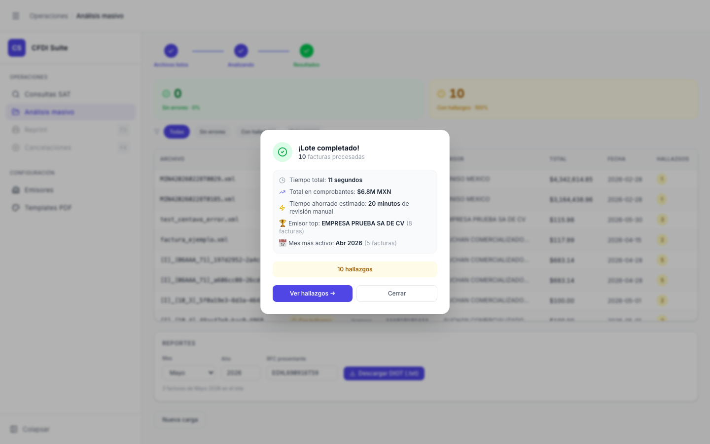

# Análisis Masivo — Modal de Lote Completado

> **Slug:** `batch-completion-modal`
> **Componente principal:** `src/components/BatchCompletionModal.tsx`
> **Trigger / Ruta:** `phase === 'done'` + `showModal === true` (primer acceso a la fase done)

---

## Propósito

Modal de celebración/resumen que aparece automáticamente al terminar el procesamiento del lote. Comunica los highlights del lote con un tono positivo: tiempo total, total monetario, emisor más frecuente y mes más activo. Permite ir directo a los hallazgos o cerrar el modal para ver la tabla completa.

---

## Cómo se llega aquí

- Automáticamente al cambiar `phase` de `'processing'` a `'done'` (el modal se muestra con `showModal = true`)
- Se muestra solo una vez por lote: cerrar el modal o hacer clic en "Ver hallazgos" establece `showModal = false`
- No vuelve a aparecer si el usuario navega fuera y regresa (la fase done persiste mientras el componente esté montado)

---

## Componentes y Layout

- **Overlay:** fondo oscuro semitransparente sobre la pantalla `masivo-done`
- **Card central (max-width ~460px, centrada):**
  - Ícono ✓ verde grande en la parte superior
  - Título: "¡Lote completado!" + "N facturas procesadas" en texto gris
  - Lista de highlights con íconos:
    - 🕐 "Tiempo total: N segundos" (o "N minutos")
    - 💰 "Total en comprobantes: $XM MXN" (si totalMonto > 0)
    - ⏱ "Tiempo ahorrado estimado: N minutos de revisión manual"
    - 🏆 "Emisor top: [NOMBRE] (N facturas)"
    - 📅 "Mes más activo: [Mes Año] (N facturas)"
  - Badge con link: "N hallazgos" (amarillo/naranja, clicable)
  - Botones:
    - "Ver hallazgos →" — primario, morado filled
    - "Cerrar" — secundario, outline

---

## Funcionalidades

1. **Ir a hallazgos:** clic en "Ver hallazgos →" → `onViewFindings()` → cierra modal + activa filtro "Con hallazgos" en la tabla
2. **Cerrar modal:** clic en "Cerrar" o en el badge de hallazgos → `onClose()` → `setShowModal(false)` → queda en `masivo-done` con filtro "Todas"
3. **Animación CountUp:** los números (tiempo, monto, conteos) animan desde 0 al valor final al abrir el modal (duración 1200–1400ms)

---

## Flujo de Navegación

- **→ `masivo-done-filtered` (hallazgos):** clic en "Ver hallazgos →"
- **→ `masivo-done` (todas):** clic en "Cerrar"

---

## Estados

| Estado | Diferencia visual |
|--------|-------------------|
| Sin hallazgos (`ok = total`) | Badge de hallazgos no aparece o muestra "0 hallazgos"; botón "Ver hallazgos" deshabilitado o ausente |
| Con hallazgos (este) | Badge amarillo con count, botón "Ver hallazgos" habilitado |
| `totalMonto === 0` | La línea del total puede estar oculta o mostrar "$0 MXN" |

---

## Edge Cases

- El modal aparece incluso si el lote tuvo 100% errores — en ese caso, las métricas de monto e insights pueden estar vacías o en 0
- "Tiempo ahorrado estimado" es un cálculo heurístico (no documentado en el código visible) — podría ser inexacto para lotes muy pequeños
- La animación CountUp requiere que el modal esté montado en el DOM; si el dispositivo tiene animaciones deshabilitadas (prefers-reduced-motion), no se ha verificado si se respeta

---

## Preguntas para el Reviewer

1. ¿Cuál es la fórmula para "Tiempo ahorrado estimado"? ¿Se debería documentar o eliminar si no es precisa?
2. ¿El modal debería aparecer también cuando todos son errores? Actualmente sí aparece — podría confundir ("¡Lote completado!" con 100% errores).
3. ¿Debería haber una opción de "No mostrar de nuevo" para usuarios avanzados que ya conocen el flujo?
4. ¿El fondo del modal permite al usuario ver la tabla de resultados por debajo (para orientación)? En la captura se ve que sí, parcialmente.
