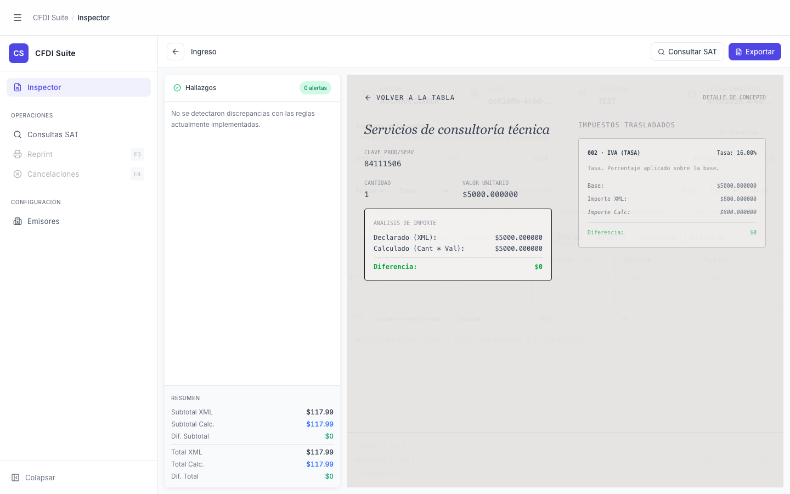

# Modal — Detalle de Concepto

> **Slug:** `concept-detail-modal`
> **Componente principal:** `src/components/ConceptDetailModal.tsx`
> **Trigger / Ruta:** `diagnose.selectedConcept !== null` en `App.tsx:236`, activado por `onSelectConcept(concept)` en `FindingsSidebar.tsx:268`

---

## Propósito

Overlay de pantalla completa (dentro del área del inspector) que muestra el desglose matemático de un concepto CFDI específico: importe declarado vs calculado con 6 decimales de precisión, y para cada impuesto trasladado: base, importe XML, importe calculado y diferencia coloreada. Permite al auditor verificar con exactitud si los montos del concepto y sus impuestos son correctos.

---

## Cómo se llega aquí

1. Vista `inspector-loaded` con un CFDI que produce hallazgos con `conceptLinks` en `FindingsSidebar`
2. Botón "Abrir concepto sugerido" (`FindingsSidebar.tsx:268`) → `onSelectConcept(suggestedConceptLink.concept)` → `diagnose.setSelectedConcept(concept)`
3. `App.tsx:236` pasa `selectedConcept` a `ConceptDetailModal` → `AnimatePresence` lo muestra con fade-in

---

## Componentes y Layout

- **Layout principal:** overlay `absolute inset-0 bg-[#E4E3E0]/95 z-20` dentro del contenedor derecho del inspector (no cubre el sidebar de navegación)
- **Encabezado:** botón "← Volver a la tabla" (izquierda) + label "Detalle de Concepto" (derecha, `text-[10px] font-mono uppercase opacity-50`)
- **Grid 2 columnas:**
  - **Izquierda:** `descripcion` en `font-serif italic` 2xl, luego `claveProdServ`, `cantidad`, `valorUnitario`, bloque de análisis de importe (declarado/calculado/diferencia)
  - **Derecha:** lista de impuestos trasladados — cada uno en tarjeta con `impuesto`, `tipoFactor`, `tasaOCuota`, `base`, `importe`, `importeCalculado`, diferencia coloreada
- **Animación:** `motion.div` con `initial={{ opacity: 0 }} → animate={{ opacity: 1 }}` en entrada, `exit={{ opacity: 0 }}` en salida vía `AnimatePresence`

---

## Funcionalidades

1. **Lectura del desglose** — vista de solo lectura, sin edición posible
2. **Volver:** botón "← Volver a la tabla" → `onClose()` → `diagnose.setSelectedConcept(null)` → el modal desaparece con animación

---

## Flujo de Navegación

- **← `inspector-loaded`:** clic en "← Volver a la tabla"
- No hay navegación hacia adelante desde este modal

---

## Estados

| Estado | Trigger | Diferencia visual |
|--------|---------|-------------------|
| Diferencia en importe = 0 | `selectedConcept.diferencia === 0` | Fila diferencia en verde |
| Diferencia en importe ≠ 0 | `selectedConcept.diferencia !== 0` | Fila diferencia en `text-red-600 font-bold` |
| Sin impuestos trasladados | `selectedConcept.impuestos.length === 0` | Columna derecha muestra texto itálico vacío |
| Impuesto con diferencia | `imp.diferencia !== 0` por cada impuesto | Fila de ese impuesto en rojo bold |

---

## Edge Cases

- El overlay cubre el área del inspector (posición `absolute`) pero el sidebar de navegación sigue accesible — el usuario puede navegar a otra vista con el modal abierto.
- `AnimatePresence` requiere que el componente esté siempre en el árbol de renderizado (renderiza `null` cuando `!selectedConcept`) para que funcione la animación de salida.
- Los valores usan `.toFixed(6)` — puede ser confuso para auditores que esperan 2 decimales en moneda MXN.
- El tooltip en los campos de impuesto usa `getExplainedMeaning` y `getExplainedTaxLabel` — si estas funciones no tienen definición para un código dado, muestran el código crudo.

---

## Preguntas para el Reviewer

1. ¿6 decimales es la precisión correcta para todos los campos del modal, o solo para la diferencia?
2. ¿El overlay debería cubrir también el sidebar con `position: fixed` para enfocarse completamente en el detalle?
3. ¿Hay navegación entre conceptos (anterior/siguiente) o el auditor debe volver a la tabla y abrir cada uno individualmente?
4. ¿Por qué el diseño usa `font-serif italic` para la descripción del concepto en un contexto de auditoría fiscal? ¿Es una decisión deliberada de diferenciación visual?
