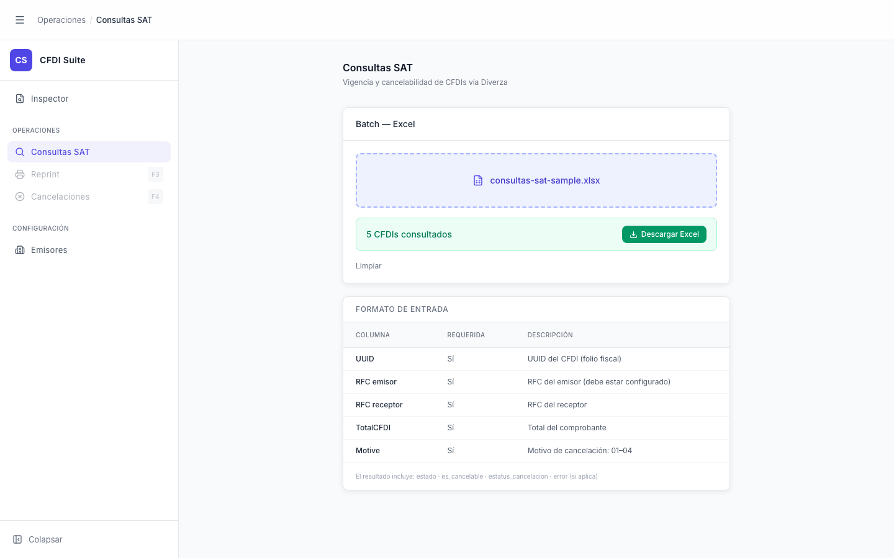

# Consultas SAT — Completado

> **Slug:** `consultas-sat-done`
> **Componente principal:** `src/components/ConsultasSATPage.tsx`
> **Trigger / Ruta:** `phase === 'done'` — activado cuando `enquiryBatch` recibe `{type:'done', job_id, total}`

---

## Propósito

Notifica al usuario que el batch terminó exitosamente y le permite descargar el Excel de resultados. El archivo incluye el estado de vigencia, cancelabilidad y estatus de cancelación para cada CFDI consultado. Una vez descargado, la pantalla regresa automáticamente al estado idle.

---

## Cómo se llega aquí

Desde `consultas-sat-processing`: cuando el stream SSE emite `{type:'done', job_id, total}`:
1. `setJobId(event.job_id)` — almacena el ID para descarga
2. `setTotal(event.total)` — total final consultado
3. `setPhase('done')`

---

## Componentes y Layout

- **Drop-zone:** sigue mostrando el archivo seleccionado (nombre en borde primary)
- **Barra de progreso:** desaparece (solo se renderiza cuando `phase === 'processing'`)
- **Bloque de éxito:** `border-emerald-200 bg-emerald-50` — muestra "`N` CFDIs consultados" + botón "Descargar Excel" en verde
- **Acciones:** botón "Iniciar consulta" reaparece (disabled porque `file` puede ser null); botón "Limpiar" visible

---

## Funcionalidades

1. **Descargar Excel:** `handleDownload()` → `downloadBatchResult(jobId)` → descarga el archivo y automáticamente llama `setJobId(null)`, `setFile(null)`, `setPhase('idle')` — la pantalla regresa a idle
2. **Limpiar sin descargar:** `handleReset()` — el resultado en el servidor queda huérfano si no se descargó

---

## Flujo de Navegación

- **→ `consultas-sat`:** automáticamente tras "Descargar Excel" exitoso, o clic en "Limpiar"

---

## Estados

Este estado es terminal; la única variación es si la descarga falla (se setea `error` inline pero `phase` permanece en `done`).

---

## Edge Cases

- `jobId` solo existe en memoria React — si el usuario recarga la página, el `jobId` se pierde y el resultado del batch queda irecuperable (no hay pantalla de "mis resultados").
- Si `downloadBatchResult(jobId)` falla (backend caído, jobId expirado), `setError()` es llamado pero `phase` no cambia a `'error'` — el usuario ve el mensaje de error pero el botón "Descargar Excel" sigue visible para reintentar.
- Tras la descarga exitosa, `setFile(null)` significa que "Iniciar consulta" queda disabled — el usuario debe seleccionar de nuevo el archivo si quiere repetir la consulta.

---

## Preguntas para el Reviewer

1. ¿Los resultados del batch tienen un TTL en el servidor? Si `jobId` expira, el usuario ve el botón "Descargar Excel" pero la descarga falla — ¿se debería comunicar esto?
2. ¿Debería mostrarse una vista previa de los primeros N resultados antes de descargar?
3. Cuando la descarga falla, ¿debería `phase` cambiar a `'error'` explícitamente para habilitar el flujo de reintento?
