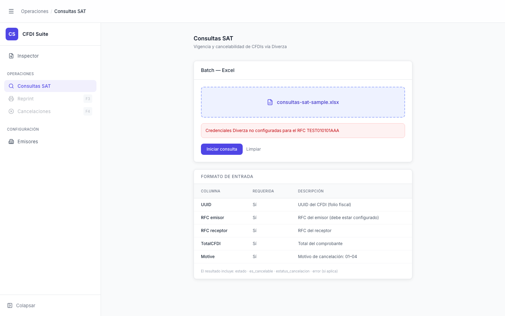

# Consultas SAT — Error

> **Slug:** `consultas-sat-error`
> **Componente principal:** `src/components/ConsultasSATPage.tsx`
> **Trigger / Ruta:** `phase === 'error'` — activado cuando `enquiryBatch` lanza una excepción que no sea `AbortError`



---

## Propósito

Informa al usuario que el batch falló con un mensaje específico del error, y le permite reintentar con el mismo archivo o limpiar para empezar de nuevo.

---

## Cómo se llega aquí

En `handleStart()` del `ConsultasSATPage`:
```
} catch (err) {
  if ((err as Error).name !== 'AbortError') {
    setError(err instanceof Error ? err.message : 'Error desconocido');
    setPhase('error');
  }
}
```

---

## Componentes y Layout

- Aparece alerta roja con el `error` message
- Botón "Iniciar consulta" vuelve a ser visible (`phase === 'error'` está en la condición `phase === 'idle' || phase === 'error'`)
- El archivo sigue cargado (`file !== null`), así que el botón "Iniciar consulta" está habilitado
- Botón "Limpiar" también visible

---

## Funcionalidades

1. **Reintentar:** botón "Iniciar consulta" con el mismo archivo → `handleStart()` de nuevo
2. **Limpiar:** `handleReset()` → `setError(null)`, `setFile(null)`, `setPhase('idle')`

---

## Flujo de Navegación

- **→ `consultas-sat-processing`:** reintentar con "Iniciar consulta"
- **→ `consultas-sat-idle`:** limpiar con "Limpiar"

---

## Estados

El estado `error` es único — muestra el mensaje y las acciones de reintento/limpieza.

---

## Edge Cases

- `error` también se setea en `handleDownload()` si la descarga falla — pero en ese caso `phase` queda en `done`, no en `error`. El componente tiene lógica `{(phase === 'error' || error) && <div>}` que muestra el error en ambos estados.
- Si el error es un `TypeError` (red caída), el mensaje sería el mensaje nativo de JavaScript (en inglés), no un mensaje amigable en español

---

## Preguntas para el Reviewer

1. ¿Los errores de red deberían mostrarse en español con mensajes amigables, o el mensaje técnico del error es suficiente para los usuarios de esta herramienta (que son internos/técnicos)?
2. ¿Debería haber un límite de reintentos automáticos, o siempre manual?
3. ¿Qué información de depuración sería útil mostrar junto al error (ej. código de status HTTP, request ID) para ayudar a diagnosticar el problema?
