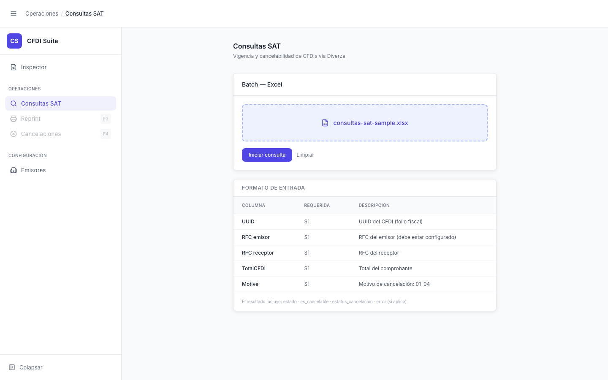

# Consultas SAT — Archivo Seleccionado

> **Slug:** `consultas-sat-file-ready`
> **Componente principal:** `src/components/ConsultasSATPage.tsx`
> **Trigger / Ruta:** `file !== null` en `ConsultasSATPage` — activado por `handleFileSelect` o `handleFileDrop`

---

## Propósito

Estado intermedio donde el usuario ya seleccionó el archivo Excel pero aún no inició la consulta. El drop-zone muestra el nombre del archivo seleccionado y el botón "Iniciar consulta" se habilita. El usuario puede revisar el nombre antes de proceder o usar "Limpiar" para cambiar el archivo.

---

## Cómo se llega aquí

- Desde `consultas-sat`: arrastrar un `.xlsx` sobre el drop-zone o hacer clic y seleccionar un archivo.

---

## Componentes y Layout

- **Layout principal:** igual a `consultas-sat` pero el drop-zone cambia visualmente:
  - Borde `border-primary-300 bg-primary-50` (en lugar de gris punteado)
  - Muestra ícono `FileSpreadsheet` + nombre del archivo en `text-primary-700`
- **Acciones habilitadas:**
  - Botón "Iniciar consulta" → ahora `!file` es `false`, por lo que está habilitado
  - Botón "Limpiar" → visible (`file && phase !== 'processing'`)

---

## Funcionalidades

1. **Iniciar consulta:** clic → `handleStart()` → transición a `consultas-sat-processing`
2. **Limpiar:** `handleReset()` → `setFile(null)`, `setPhase('idle')`, limpia el input → regresa a `consultas-sat` idle
3. **Cambiar archivo:** clic en el drop-zone (que sigue siendo clickeable) para abrir file picker y reemplazar el archivo

---

## Flujo de Navegación

- **← `consultas-sat`:** seleccionando un archivo
- **→ `consultas-sat-processing`:** clic en "Iniciar consulta"
- **→ `consultas-sat`:** clic en "Limpiar"

---

## Estados

Este es un sub-estado de `consultas-sat` donde `phase === 'idle'` pero `file !== null`. No hay variaciones visuales adicionales.

---

## Edge Cases

- El archivo puede ser reemplazado haciendo clic en el drop-zone nuevamente (no hay bloqueo de re-selección).
- `handleReset()` limpia `fileInputRef.current.value` para permitir seleccionar el mismo archivo nuevamente si el usuario lo necesita.

---

## Preguntas para el Reviewer

1. ¿Debería mostrarse el tamaño del archivo seleccionado para que el usuario tenga una estimación del tiempo de procesamiento?
2. ¿Debería validarse mínimamente el Excel antes de mostrar "Iniciar consulta" (ej. verificar que tenga al menos una fila)?
