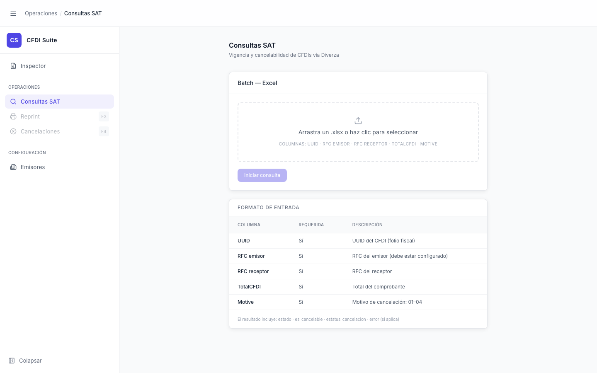

# Consultas SAT — Inicial

> **Slug:** `consultas-sat-idle`
> **Componente principal:** `src/components/ConsultasSATPage.tsx`
> **Trigger / Ruta:** `activeView === 'consultas-sat'` (clic en "Consultas SAT" en sidebar)

---

## Propósito

Permite al usuario cargar un archivo Excel con una lista de CFDIs para consultar su vigencia y cancelabilidad en masa vía el servicio Diverza. Es la herramienta de operación batch — para cuando se necesita verificar cientos de CFDIs de una vez, no uno a uno como en el inspector.

---

## Cómo se llega aquí

- Clic en "Consultas SAT" en la barra lateral (AppNav)
- Estado inicial: `phase === 'idle'`, `file === null`

---

## Componentes y Layout

- **Layout principal:** Columna única centrada, `max-w-2xl`, padding `py-8`
- **Componentes hijos visibles:**
  - `AppNav` — "Consultas SAT" activo
  - `AppHeader` — breadcrumb "Operaciones / Consultas SAT"
  - Tarjeta "Batch — Excel" — zona de drop + botón "Iniciar consulta" (deshabilitado sin archivo)
  - Tarjeta "Formato de entrada" — tabla de referencia de columnas requeridas
- **Estado del sidebar:** Expandido

---

## Funcionalidades

1. **Seleccionar archivo:** arrastrar `.xlsx` a la zona de drop, o hacer clic para abrir el selector
2. **Iniciar consulta:** botón "Iniciar consulta" (habilitado solo cuando `file !== null`) — cambia a fase `processing`
3. **Limpiar selección:** botón "Limpiar" (solo visible cuando hay archivo y no se está procesando) — `handleReset()`
4. **Consultar el formato:** la tabla inferior siempre visible muestra las columnas requeridas del Excel de entrada

---

## Flujo de Navegación

- **← Inspector:** clic en "Inspector" en sidebar
- **→ `consultas-sat-processing`:** clic en "Iniciar consulta" con archivo cargado
- **→ Otras vistas:** navegación por sidebar (no interrumpe estado del componente al regresar)

---

## Estados

| Estado | Trigger | Diferencia visual |
|--------|---------|-------------------|
| Sin archivo (`idle`) | Estado inicial o después de `handleReset()` | Drop zone con borde gris, botón "Iniciar" deshabilitado (opacity 40%) |
| Con archivo (`idle`) | Archivo `.xlsx` seleccionado | Drop zone azul con ícono de spreadsheet y nombre del archivo, botón "Iniciar" habilitado, botón "Limpiar" visible |
| `processing` | Clic en "Iniciar consulta" | Ver `consultas-sat-processing` |
| `done` | Batch completado | Ver `consultas-sat-done` |
| `error` | Fallo en batch | Ver `consultas-sat-error` |

---

## Edge Cases

- La zona de drop solo acepta `.xlsx` — otros formatos se ignoran silenciosamente (sin alert) porque `handleFileDrop` filtra por `dropped?.name.endsWith('.xlsx')`
- El selector de archivos (`<input accept=".xlsx">`) también filtra por extensión, pero un usuario técnico podría forzar otro formato — lo cual no dispara error hasta que el backend lo rechaza
- Si el usuario navega a otra vista durante el procesamiento y regresa, el componente no persiste su estado entre unmounts — volvería al estado inicial (React desmonta y remonta el componente)

---

## Preguntas para el Reviewer

1. ¿Debería mostrar un mensaje de validación cuando el usuario arrastra un archivo que no es `.xlsx`? Actualmente se ignora sin feedback.
2. Si el usuario cierra la vista durante el procesamiento (`abortRef.current?.abort()` no se llama automáticamente en unmount), ¿la consulta batch continúa en el backend o se cancela sola?
3. ¿El "Formato de entrada" debería incluir un link a un archivo `.xlsx` de ejemplo descargable? Sería muy útil para onboarding.
4. ¿Qué límite de filas soporta el batch? ¿Hay un timeout o un tamaño máximo del Excel?
