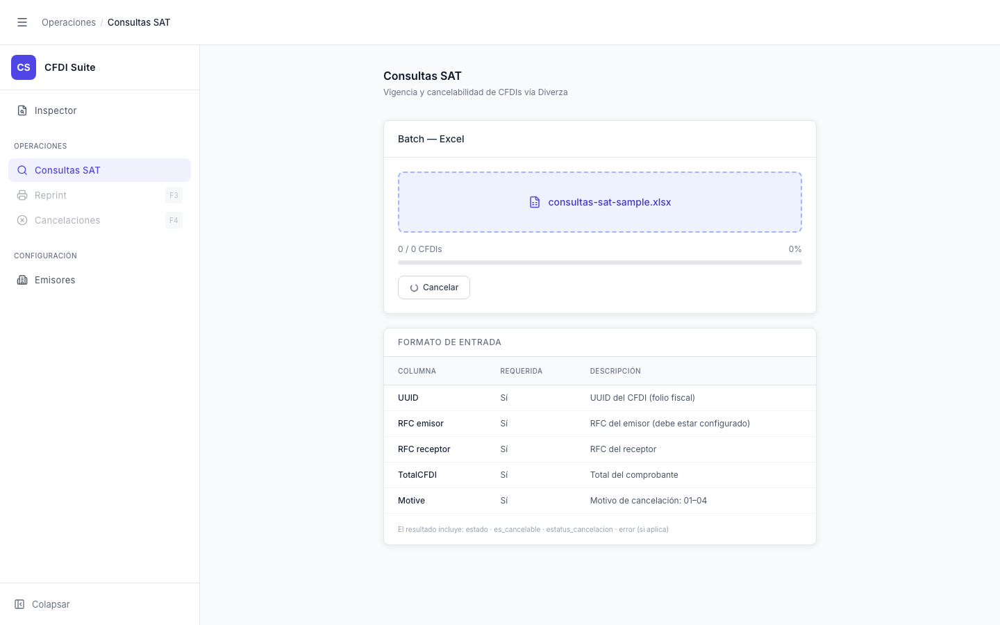

# Consultas SAT — Procesando

> **Slug:** `consultas-sat-processing`
> **Componente principal:** `src/components/ConsultasSATPage.tsx`
> **Trigger / Ruta:** `phase === 'processing'` — activado por `handleStart()` al hacer clic en "Iniciar consulta"

---

## Propósito

Estado activo de consulta batch. El backend procesa la lista de CFDIs del Excel secuencialmente, consultando el SAT vía Diverza por cada UUID. La barra de progreso y el contador `processed / total` se actualizan en tiempo real con cada evento SSE del servidor. Para listas grandes, este estado puede durar minutos.

---

## Cómo se llega aquí

Desde `consultas-sat-file-ready`:
1. Clic en "Iniciar consulta" → `handleStart()`
2. `setPhase('processing')` (sincrónico) — la UI cambia inmediatamente
3. `enquiryBatch(file, progressCallback, abort.signal)` inicia el streaming via `POST /api/sat/enquiry/batch`
4. Cada línea `data: {type:"progress", processed, total}` del stream actualiza `setProcessed` y `setTotal`

---

## Componentes y Layout

- **Drop-zone:** sigue mostrando el nombre del archivo (el drop-zone no desaparece)
- **Barra de progreso:** aparece — `processed / total CFDIs` + `pct%`
- **Acciones:** botón "Cancelar" con spinner `Loader2` animado; "Iniciar consulta" y "Limpiar" desaparecen

---

## Funcionalidades

1. **Monitorear progreso:** la barra avanza con cada evento `{type:'progress', processed, total}`
2. **Cancelar:** clic en "Cancelar" → `abortRef.current?.abort()` → `AbortError` capturado → `setPhase('idle')`

---

## Flujo de Navegación

- **→ `consultas-sat-done`:** evento `{type:'done', job_id, total}`
- **→ `consultas-sat` con error:** excepción en `enquiryBatch` que no sea `AbortError` → `setPhase('error')`
- **→ `consultas-sat`:** clic en "Cancelar" (AbortError no setea `error`)

---

## Estados

| Estado | Trigger | Diferencia visual |
|--------|---------|-------------------|
| Inicio del batch | `processed=0, total=0` | Barra al 0%, "0 / 0 CFDIs" |
| En progreso | Eventos `progress` recibidos | Barra avanzando, contadores actualizándose |

---

## Edge Cases

- Si el usuario navega a otra vista (`activeView` cambia), `ConsultasSATPage` se desmonta. El `AbortController` NO se llama automáticamente — el batch continúa en el backend aunque no haya UI para recibir los eventos.
- `pct = total > 0 ? Math.round((processed / total) * 100) : 0` — evita división por cero al inicio del batch.
- Si el stream SSE se interrumpe a mitad, el `while(true)` en `enquiryBatch` termina cuando `reader.read()` devuelve `done=true`, sin lanzar error.

---

## Preguntas para el Reviewer

1. ¿Debería `ConsultasSATPage` llamar `abort()` en el `useEffect` cleanup al desmontarse?
2. ¿Hay un timeout del lado del backend para trabajos que nadie está escuchando?
3. ¿Se debería mostrar una estimación de tiempo restante basada en la velocidad promedio de procesamiento?
