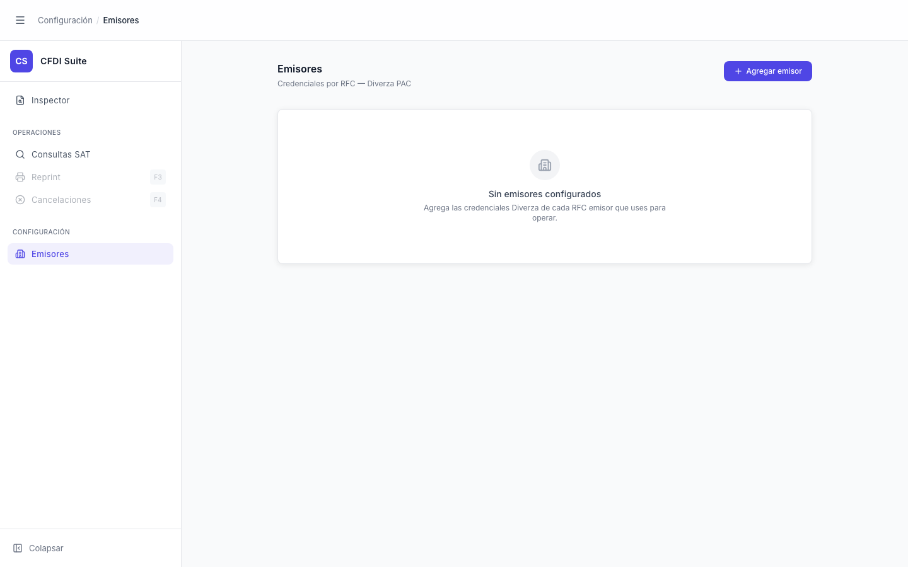

# Emisores — Sin Emisores Configurados

> **Slug:** `emisores-empty`
> **Componente principal:** `src/components/EmisoresPage.tsx`
> **Trigger / Ruta:** `!loading && !error && emisores.length === 0` en `EmisoresPage.tsx:259`

---

## Propósito

Estado vacío de la gestión de emisores. Indica al usuario que aún no hay credenciales Diverza configuradas para ningún RFC emisor. Guía al usuario a agregar el primer emisor para habilitar la consulta de CFDIs al SAT.

---

## Cómo se llega aquí

1. Clic en "Emisores" en el sidebar → `EmisoresPage` se monta
2. `useEffect` llama `listEmisores()` → `GET /api/emisores` devuelve array vacío `[]`
3. `setEmisores([])`, `setLoading(false)` → se renderiza el estado vacío

---

## Componentes y Layout

- **Layout principal:** columna centrada `max-w-4xl`, scroll vertical
- **Header de página:** "Emisores" + subtítulo "Credenciales por RFC — Diverza PAC" + botón "Agregar emisor"
- **Card de contenido:** estado vacío centrado con ícono `Building2` gris, texto "Sin emisores configurados" y descripción contextual
- El bloque vacío usa `flex flex-col items-center justify-center gap-3 p-16 text-center`

---

## Funcionalidades

1. **Agregar emisor:** clic en botón "Agregar emisor" → `setModal('create')` → abre `EmisorModal` para nuevo emisor

---

## Flujo de Navegación

- **← Origen:** cualquier vista, clic en "Emisores" (con backend activo y BD vacía)
- **→ `emisores-modal-create`:** clic en "Agregar emisor"
- **→ Emisores con lista** (no documentado separadamente): tras guardar el primer emisor y `reload()` devuelve datos

---

## Estados

Solo hay un estado en esta pantalla; el estado de carga `loading === true` transiciona rápidamente y no se captura visualmente.

---

## Edge Cases

- `reload()` se llama automáticamente después de `createEmisor`, `updateEmisor` o `deleteEmisor` — la lista se actualiza sin intervención del usuario.
- Si entre la carga inicial y el render el backend falla, el estado podría quedar en vacío cuando debería ser error (si `setEmisores` se llamó antes de que fallara una segunda petición).

---

## Preguntas para el Reviewer

1. ¿Debería el estado vacío tener un botón CTA (call-to-action) directo "Agregar tu primer emisor" además del botón en el header?
2. La descripción dice "Diverza PAC" — ¿se planea soportar otros PACs? Si es así, ¿el campo PAC sería un selector?
