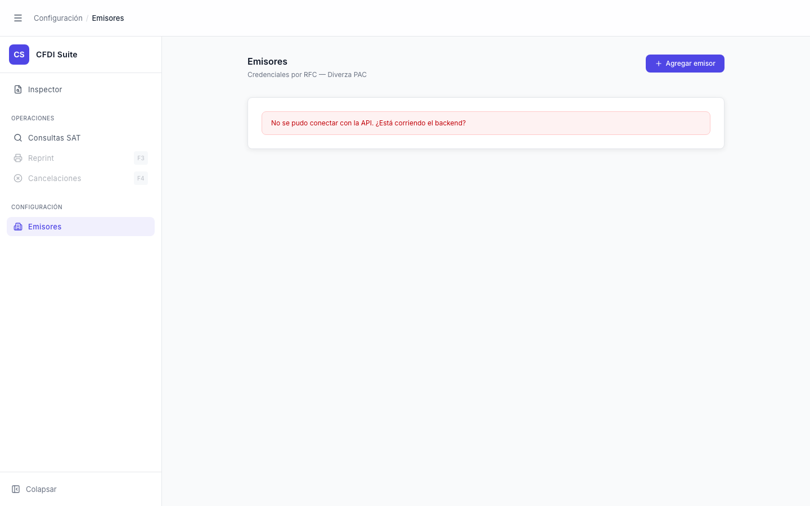

# Emisores — Error de Conexión

> **Slug:** `emisores-error`
> **Componente principal:** `src/components/EmisoresPage.tsx`
> **Trigger / Ruta:** `!loading && error !== ''` en `EmisoresPage` — activado cuando `listEmisores()` lanza excepción (backend no disponible)

---

## Propósito

Muestra un mensaje de error cuando el backend no está disponible al cargar la lista de emisores. Informa al usuario que la funcionalidad requiere el backend activo y sugiere verificar si está corriendo.

---

## Cómo se llega aquí

1. Clic en "Emisores" en el sidebar → `setActiveView('emisores')` → `EmisoresPage` se monta
2. `useEffect(() => { reload(); }, [])` ejecuta `listEmisores()` → `GET /api/emisores`
3. Si la llamada falla (backend no disponible, red error, 500), el catch setea `setError('No se pudo conectar con la API. ¿Está corriendo el backend?')` y `setLoading(false)`

---

## Componentes y Layout

- **Layout principal:** columna centrada `max-w-4xl`, igual estructura que `emisores-empty`
- **Header de página:** "Emisores" + botón "Agregar emisor" (siempre visible, independiente del estado)
- **Card de contenido:** muestra `
` con el mensaje de error

---

## Funcionalidades

1. **Agregar emisor:** el botón "Agregar emisor" sigue habilitado — si se hace clic, abrirá `EmisorModal` aunque la lista haya fallado (el save intentará `POST /api/emisores`)
2. No hay botón de reintento — el único modo de reintentar es navegar a otra vista y volver a "Emisores"

---

## Flujo de Navegación

- **← Origen:** cualquier vista, clic en "Emisores"
- **→ `emisores-modal-create`:** clic en "Agregar emisor" (aunque la lista falle)

---

## Estados

Solo existe este estado de error; `loading === true` no es visible (transiciona rápido a error o success).

---

## Edge Cases

- No hay botón "Reintentar" — el usuario debe navegar fuera y volver para intentar de nuevo.
- El botón "Agregar emisor" permanece habilitado durante el estado de error. Si el usuario crea un emisor sin que la lista haya cargado, el save puede tener éxito pero la lista no se mostrará correctamente al cerrar el modal (sin reintento automático).
- `reload()` en el finally de `createEmisor`/`updateEmisor` relanzará la carga — si el backend vuelve durante este flujo, la lista se actualizará.

---

## Preguntas para el Reviewer

1. ¿Debería haber un botón "Reintentar" que llame a `reload()` directamente?
2. ¿El mensaje de error hardcodeado `"No se pudo conectar con la API. ¿Está corriendo el backend?"` es apropiado para usuarios finales (no desarrolladores)?
3. ¿Debería el estado de error distinguir entre "no disponible" y "error 500" para dar más contexto al usuario?
