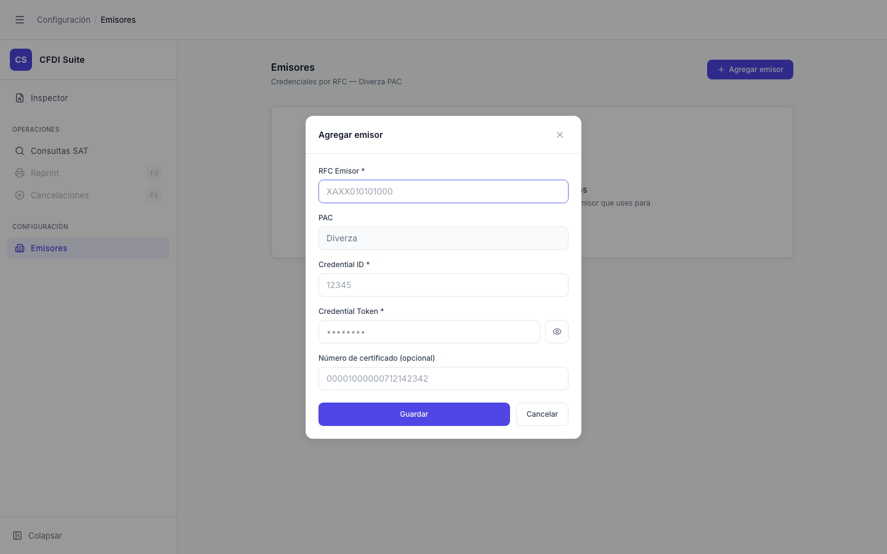

# Modal — Crear Emisor

> **Slug:** `emisores-modal-create`
> **Componente principal:** `src/components/EmisoresPage.tsx` → `EmisorModal` (componente interno)
> **Trigger / Ruta:** `modal === 'create'` en `EmisoresPage` — activado por clic en "Agregar emisor"

---

## Propósito

Formulario modal para registrar las credenciales Diverza de un RFC emisor. Los campos recogen el RFC, el Credential ID y el Credential Token (secreto) necesarios para realizar consultas SAT. Sin estos datos, el módulo "Consultar SAT" del Inspector no puede verificar el estado de los CFDIs de ese emisor.

---

## Cómo se llega aquí

- Desde `emisores-empty` o `emisores-loaded` (con lista): clic en "Agregar emisor" → `setModal('create')` → `EmisorModal` se renderiza con `initial=undefined`

---

## Componentes y Layout

- **Layout:** overlay `fixed inset-0 z-30 flex items-center justify-center bg-black/40` — cubre toda la pantalla
- **Modal card:** `max-w-md rounded-xl border border-gray-200 bg-white shadow-soft-2`
- **Header del modal:** "Agregar emisor" + botón X de cierre
- **Campos del formulario:**
  - RFC Emisor* (texto, placeholder `XAXX010101000`)
  - PAC (read-only, siempre "Diverza")
  - Credential ID*
  - Credential Token* (password por defecto, toggle `Eye/EyeOff`)
  - Número de certificado (opcional)
- **Error inline:** `border-red-200 bg-red-50` aparece si hay error de validación o de la API
- **Acciones:** botón "Guardar" (submit) + botón "Cancelar"

---

## Funcionalidades

1. **Guardar:** `handleSubmit()` valida que RFC y Credential ID no estén vacíos, y que el token esté presente (en creación). Llama `onSave(data)` → `createEmisor(data)` → `POST /api/emisores`
2. **Mostrar/ocultar token:** botón Eye/EyeOff alterna `showToken` → cambia `type` del input entre `password` y `text`
3. **Cancelar:** `onClose()` → `setModal(null)` → modal desaparece sin guardar
4. **RFC en mayúsculas:** se normaliza con `rfc.trim().toUpperCase()` antes de enviar

---

## Flujo de Navegación

- **← `emisores-empty` o `emisores-loaded`:** se cierra el modal
- **→ `emisores-empty` o `emisores-loaded`:** después de guardar exitosamente o cancelar (`reload()` actualiza la lista)

---

## Estados

| Estado | Trigger | Diferencia visual |
|--------|---------|-------------------|
| Token oculto | `showToken === false` | Campo tipo `password` con puntos |
| Token visible | `showToken === true` | Campo tipo `text`, ícono EyeOff |
| Guardando | `saving === true` | Botón muestra "Guardando…", disabled |
| Error de validación | RFC/CredID vacíos o token ausente en creación | Mensaje de error rojo inline |
| Error de API | Backend rechaza el save | Error de la API en el mensaje inline |

---

## Edge Cases

- El RFC se deshabilita en el modal de edición (`disabled={!!initial}`) pero en creación es editable. El RFC es la clave primaria — crear dos emisores con el mismo RFC resulta en error del backend.
- `credential_token` con valor vacío en modo edición significa "no cambiar el token" (la UI lo indica con placeholder `"dejar vacío para no cambiar"`). La API recibe `credential_token: '__keep__'` como señal especial.
- El foco se posiciona automáticamente en el primer campo al abrir el modal (`useEffect(() => { firstRef.current?.focus(); }, [])`).
- El campo PAC siempre muestra "Diverza" (hardcodeado como `pac: 'diverza'` en `handleSubmit`).

---

## Preguntas para el Reviewer

1. El valor especial `'__keep__'` para el token en edición es un contrato implícito entre frontend y backend — ¿está documentado en el contrato de la API?
2. ¿Debería validarse el formato del RFC (12 o 13 caracteres alfanuméricos) antes de enviar al backend?
3. ¿La edición del certificado es solo informativa, o el número de certificado se usa en las consultas SAT?
4. ¿Se planea soportar otros PACs además de Diverza? Si es así, el campo PAC debería ser un selector.
