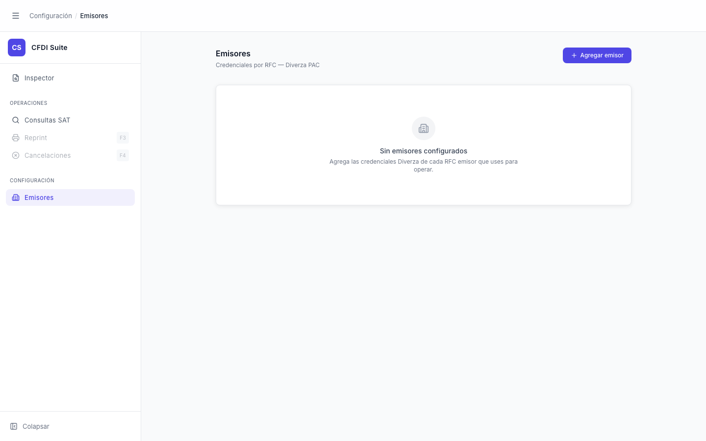

# Emisores — Lista / Estado Vacío

> **Slug:** `emisores-view`
> **Componente principal:** `src/components/EmisoresPage.tsx`
> **Trigger / Ruta:** `activeView === 'emisores'` (clic en "Emisores" en sidebar)

---

## Propósito

Permite configurar las credenciales Diverza por RFC emisor. Cada registro mapea un RFC de emisor a sus credenciales del PAC (Credential ID, Token, Certificate Number). Estas credenciales son necesarias para que "Consultas SAT" pueda consultar la vigencia de los CFDIs emitidos por ese RFC.

---

## Cómo se llega aquí

- Clic en "Emisores" en la barra lateral
- Al montar el componente, `EmisoresPage.tsx` hace una llamada `GET /emisores` al backend y setea los resultados en `useState<Emisor[]>([])`.

---

## Componentes y Layout

- **Layout principal:** Columna única, padding superior, título con botón "Agregar emisor" a la derecha
- **Componentes hijos visibles:**
  - `AppNav` — "Emisores" activo
  - `AppHeader` — breadcrumb "Configuración / Emisores"
  - Área principal: muestra UNO de tres estados según la respuesta del backend
- **Estado del sidebar:** Expandido

---

## Funcionalidades

1. **Agregar emisor:** botón "+ Agregar emisor" (siempre visible) → abre `EmisorModal` en modo creación (`setModal('create')`)
2. **Editar emisor:** ícono de edición en cada fila de la tabla → abre `EmisorModal` con datos del emisor (`setModal(em)`)
3. **Eliminar emisor:** ícono de basura en cada fila → `DELETE /emisores/:rfc` con estado `deleting[rfc]`

---

## Flujo de Navegación

- **← Cualquier vista:** navegación por sidebar
- **→ `emisores-modal-add`:** botón "+ Agregar emisor"
- **→ `emisores-modal-edit`:** ícono de edición en una fila

---

## Estados

| Estado | Trigger | Diferencia visual |
|--------|---------|-------------------|
| `loading` | GET /emisores en curso | Spinner y texto "Cargando emisores…" (transient, difícil de capturar) |
| `error` | GET /emisores falla (backend no corre) | Alerta roja: "No se pudo conectar con la API. ¿Está corriendo el backend?" |
| `empty` | GET /emisores retorna `[]` | Ícono Building2 + "Sin emisores configurados" + descripción (estado del screenshot) |
| `loaded` | GET /emisores retorna emisores | Tabla con filas: RFC, PAC, Credential ID, Certificate #, acciones |
| `deleting` | DELETE en curso para un RFC | Ícono de basura del RFC en cuestión muestra spinner |

---

## Edge Cases

- Al eliminar un emisor que está siendo usado en una consulta activa en `ConsultasSATPage`, la consulta puede fallar con credencial inválida — no hay validación cruzada
- El estado `error` en el screenshot anterior (primer run sin backend) es el estado real cuando el backend no está disponible — el botón "+ Agregar emisor" sigue activo aunque el modal no pueda guardar
- No hay paginación en la tabla de emisores — si una empresa tiene 50+ RFCs, la tabla puede volverse muy larga

---

## Preguntas para el Reviewer

1. ¿El usuario puede tener emisores de diferentes PACs (Diverza, otro)? El campo PAC parece fijo pero hay un campo en el formulario.
2. ¿Qué pasa si dos usuarios del sistema configuran el mismo RFC con credenciales diferentes? ¿Hay algún mecanismo de conflicto o override?
3. El estado `error` muestra "¿Está corriendo el backend?" — ¿eso es apropiado para un entorno de producción donde el usuario no debería saber de backends?
4. ¿Los tokens almacenados están encriptados en el backend, o se guardan en texto plano? El reviewer de seguridad debe verificarlo.
