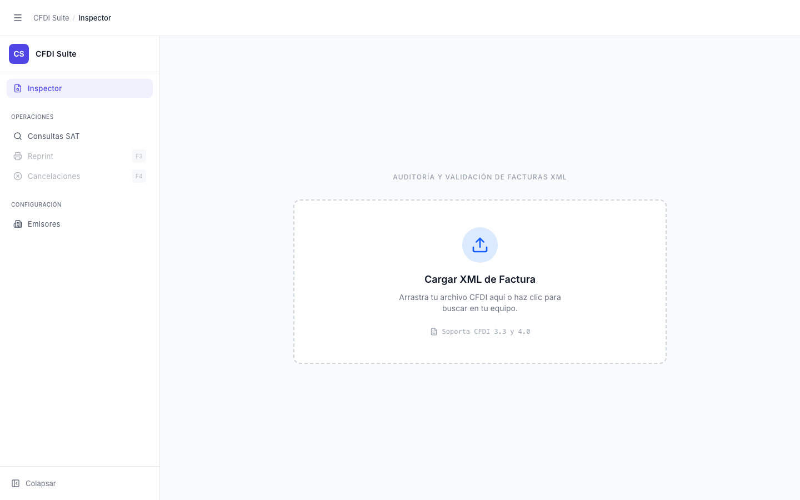

# Inspector — Estado Vacío

> **Slug:** `inspector-empty`
> **Componente principal:** `src/components/FileUpload.tsx`
> **Trigger / Ruta:** `activeView === 'inspector'` AND `cfdi === null` en `App.tsx:161–165`

---

## Propósito

Punto de entrada del módulo Inspector. El usuario arrastra o selecciona un archivo XML de CFDI (3.3 o 4.0) para iniciar el flujo de auditoría fiscal. Es la única pantalla desde la que se puede cargar un comprobante nuevo; toda la funcionalidad de análisis está bloqueada hasta que se proporcione un archivo.

---

## Cómo se llega aquí

- Al abrir la app por primera vez (`activeView` inicia en `'inspector'`, `cfdi` inicia en `null`).
- Después de hacer clic en "←" (botón reset) desde `inspector-loaded`, que llama `resetAll()` en `App.tsx:133`.
- Si el análisis backend falla, la app muestra `alert()` y permanece en este estado (no navega a error screen).

---

## Componentes y Layout

- **Layout principal:** Panel centrado `max-w-2xl w-full`, fondo `bg-gray-50`, alto completo disponible
- **Componentes hijos visibles:**
  - `AppHeader` — breadcrumb "CFDI Suite / Inspector" (muestra sección y label de la vista activa)
  - `AppSidebar` — expandido (w-72), ítem "Inspector" activo en azul
  - `FileUpload` — drop-zone con borde punteado, input oculto `accept=".xml"`

---

## Funcionalidades

1. **Arrastrar y soltar** un `.xml` sobre la zona activa el análisis (feedback visual: borde azul `border-blue-500`).
2. **Clic** en la zona abre el file picker nativo del sistema operativo.
3. Solo acepta `.xml`; otros tipos muestran `alert("Por favor sube un archivo XML válido.")`.
4. Navegar a otras vistas (Consultas SAT, Emisores) mediante el sidebar — el estado vacío del inspector se preserva.

---

## Flujo de Navegación

- **← Origen:** estado inicial de la app, o reset desde `inspector-loaded`
- **→ inspector-loading:** al seleccionar archivo válido
- **→ inspector-loaded:** al completar análisis exitosamente

---

## Estados

| Estado | Trigger | Diferencia visual |
|--------|---------|-------------------|
| `idle` | Por defecto | Ícono Upload azul, borde gris punteado |
| `isDragging` | `onDragOver` sobre la zona | Borde `border-blue-500 bg-blue-50/50` |
| `isLoading/reading` | FileReader iniciado | Zona cambia a pantalla de progreso — ver `inspector-loading` |
| `isLoading/analyzing` | Archivo leído, backend procesando | Spinner azul, barra de análisis — ver `inspector-loading` |

---

## Edge Cases

- Solo valida extensión (`.xml`) y `file.type === "text/xml"`, no estructura. Un XML malformado pasa el filtro inicial y falla en el backend con alert.
- Si se arrastran múltiples archivos, `e.dataTransfer.files[0]` procesa solo el primero, sin aviso al usuario.
- Sin límite de tamaño: archivos grandes se leen completos en memoria antes de enviarse al backend.

---

## Preguntas para el Reviewer

1. El `alert()` para errores de archivo y de backend rompe el design system — ¿se planea migrar a mensaje inline o toast?
2. ¿Debería el componente validar que el XML comience con `<?xml` o `<cfdi:Comprobante` antes de enviarlo al backend?
3. Si el usuario arrastra varios archivos, ¿debería procesarse solo el primero con un aviso, o mostrarse un error explícito?
4. El `onClick` en la zona llama `fileInputRef.current?.click()` programáticamente — ¿está probado en Safari, que bloquea este patrón fuera de interacción directa?
