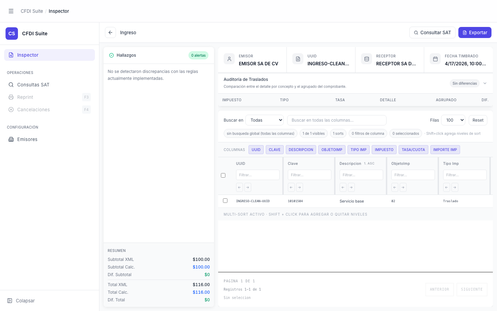

# Inspector — CFDI Ingresos

> **Slug:** `inspector-ingreso`
> **Componente principal:** `src/App.tsx`
> **Trigger / Ruta:** `activeView === 'inspector'` + `cfdi !== null` + `profile === 'ingresos'`

---

## Propósito

Vista principal de auditoría de un CFDI de tipo ingresos. Muestra el análisis completo: metadatos del comprobante, hallazgos de discrepancias, auditoría de traslados de impuestos, y tabla de conceptos con sus columnas fiscales. Permite consultar la vigencia del CFDI en el SAT y exportar los datos a Excel.

---

## Cómo se llega aquí

1. Desde `inspector-empty`, el usuario selecciona o arrastra un `.xml`
2. `FileUpload.tsx` llama a `onFileSelect(content)` → `App.tsx:handleFileSelect`
3. `handleFileSelect` llama a `analyzeCFDI(xml)` del backend (`/api/analyze`)
4. Backend retorna `{ result, meta }` con `profile === 'ingresos'`
5. `setCfdi(result.cfdi)` hace que `App.tsx:163` cambie `!cfdi ? <FileUpload/> : <layout cargado>`

---

## Componentes y Layout

- **Layout principal:** Tres zonas: sidebar izquierdo fijo, columna izquierda de hallazgos (fija), área central/derecha scrollable
- **Componentes hijos visibles:**
  - `AppNav` — sidebar con `Inspector` activo
  - `AppHeader` — breadcrumb "CFDI Suite / Inspector"
  - `InspectorHeader` — perfil del CFDI, botones "Consultar SAT" y "Exportar"
  - `CfdiSummaryHeader` — 4 tarjetas: Emisor, UUID, Receptor, Fecha Timbrado
  - `FindingsSidebar` — panel izquierdo con hallazgos y resumen de totales
  - `TaxAuditPanel` — panel colapsable de auditoría de traslados (inicia expandido)
  - `ExtractWorkspace` — toolbar + tabla virtualizada + paginación
- **Estado del sidebar:** Expandido

---

## Funcionalidades

1. **Consultar SAT:** botón en `InspectorHeader` llama a `satEnquiry.run()` — consulta vigencia del CFDI via backend Diverza. Botón deshabilitado si no hay `rfcEmisor` o si ya está consultando.
2. **Exportar:** descarga la tabla actual como Excel via `exportCurrentTable()`
3. **Colapsar/expandir TaxAuditPanel:** clic en la fila del panel — `setTaxAuditExpanded(!taxAuditExpanded)`
4. **Buscar en tabla:** campo de texto en `ExtractWorkspaceToolbar` filtra filas en tiempo real
5. **Filtrar por columna:** dropdown en toolbar selecciona columna de búsqueda
6. **Cambiar page size:** dropdown [50, 100, 250, 500, 1000] filas
7. **Ordenar:** clic en header de columna; Shift+click para multi-sort
8. **Ocultar/mostrar columnas:** pills de columnas debajo del toolbar
9. **Resetear filtros:** botón "Reset" en toolbar
10. **Cargar otro CFDI:** botón atrás (flecha) en `InspectorHeader` → `resetAll()` regresa a `inspector-empty`

---

## Flujo de Navegación

- **← `inspector-empty`:** botón atrás o `resetAll()`
- **→ `concept-detail-modal`:** clic en "Abrir concepto sugerido" dentro de `FindingsSidebar` (solo cuando hay hallazgos con conceptLinks)
- **→ `tax-audit-collapsed`:** clic en el panel `TaxAuditPanel` mientras está expandido

---

## Estados

| Estado | Trigger | Diferencia visual |
|--------|---------|-------------------|
| Default (Sin SAT) | CFDI cargado, sin consulta SAT | Botón "Consultar SAT" en azul, sin badge de resultado |
| SAT consultando | Clic en "Consultar SAT" | Botón muestra spinner + "Consultando…" deshabilitado |
| SAT con resultado | Backend retorna `EnquiryResult` | `SatResultBadge` aparece junto al botón (verde/rojo según estado) |
| SAT con error | Backend falla | Texto rojo truncado en lugar del badge |
| Exportado | `exportCurrentTable()` exitoso | Botón cambia a verde "Exportado" |
| Sin datos de export | `exportCurrentTable()` sin filas | Botón cambia a rojo "Sin datos" |
| Hallazgos presentes | `cfdi.findings.length > 0` | Badge naranja/rojo en `FindingsSidebar`, lista de findings |
| Sin hallazgos | `cfdi.findings.length === 0` | Badge verde "0 alertas", mensaje "No se detectaron discrepancias…" |

---

## Edge Cases

- `rfcEmisor` se toma de `ingresoRows[0]?.rfcEmisor` — si el primer concepto no tiene RFC emisor, el botón "Consultar SAT" queda permanentemente deshabilitado
- El botón "Exportar" exporta SOLO las filas del filtro activo, no todas las filas cargadas — esto no es evidente en la UI
- El perfil `ingresos` vs `pagos` cambia completamente las columnas de la tabla y el dataset; si el XML es "unknown" aparece como ingresos por defecto (`activeDatasetType: profile === 'pagos' ? 'pagos' : 'ingresos'`)

---

## Preguntas para el Reviewer

1. ¿El botón "Consultar SAT" debería ser más prominente o estar más contextualizado? Actualmente parece secundario al botón "Exportar" visualmente.
2. Cuando el usuario exporta, el archivo incluye solo los datos filtrados — ¿debería haber un aviso que indique esto, o siempre se esperaría exportar el dataset completo?
3. El layout de 3 columnas comprime el espacio disponible para la tabla de conceptos. ¿Cómo se ve en pantallas de 1366x768 (laptop estándar)?
4. ¿El comportamiento de "resetear filtros" borra también la selección de filas y el orden activo, o solo los filtros de columna?
