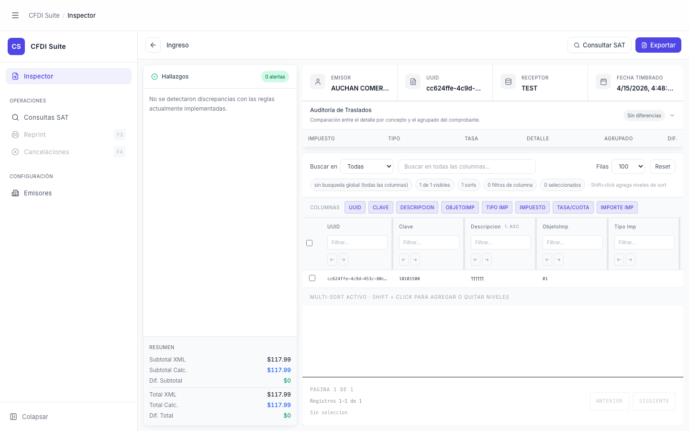

# Inspector — CFDI Cargado

> **Slug:** `inspector-loaded`
> **Componente principal:** `src/App.tsx` (bloque `activeView === 'inspector' && cfdi`)
> **Trigger / Ruta:** `activeView === 'inspector'` AND `cfdi !== null` en `App.tsx:185`

---

## Propósito

Vista principal de auditoría fiscal. Después de analizar el XML con el backend (python-satcfdi), muestra un resumen del comprobante, el panel de auditoría de traslados de impuestos, la tabla de extracto de conceptos/pagos, y los hallazgos del análisis en el sidebar izquierdo. Desde aquí el auditor puede exportar la tabla a Excel, consultar el estado del CFDI en el SAT (si el emisor tiene credenciales Diverza), y profundizar en conceptos específicos con discrepancias.

---

## Cómo se llega aquí

Después de `inspector-loading`: cuando `useCfdiAnalysis.handleFileSelect()` completa exitosamente, `setCfdi(result.cfdi)` hace que `App.tsx:185` renderice esta vista.

---

## Componentes y Layout

- **Layout principal:** tres paneles verticales + header de inspección:
  - `InspectorHeader` — barra superior con botón reset, label de perfil, botón "Consultar SAT", botón "Exportar"
  - `FindingsSidebar` — sidebar izquierdo con hallazgos del análisis (findings)
  - Panel derecho con dos bloques:
    1. `CfdiSummaryHeader` + `TaxAuditPanel` — resumen del comprobante y análisis de traslados de impuestos
    2. `ExtractWorkspace` — tabla de conceptos (ingresos) o pagos (pagos), con búsqueda y paginación
  - `ConceptDetailModal` — overlay que aparece cuando `diagnose.selectedConcept !== null`

---

## Funcionalidades

1. **Consultar SAT:** botón "Consultar SAT" en `InspectorHeader` → llama `satEnquiry.consult(satEnquiryData)` → `POST /api/sat/enquiry` — muestra badge con estado de vigencia
2. **Exportar tabla:** botón "Exportar" → `exportCurrentTable()` → descarga Excel de la tabla actual
3. **Resetear:** botón "←" → `resetAll()` → regresa a `inspector-empty`
4. **Buscar en tabla:** campo de búsqueda en `ExtractWorkspaceToolbar`
5. **Abrir detalle de concepto:** en `FindingsSidebar`, botón "Abrir concepto sugerido" → abre `ConceptDetailModal`
6. **Colapsar/expandir panel de auditoría:** toggle en `TaxAuditPanel` para `taxAuditExpanded`
7. **Navegar a otras vistas** desde el sidebar (el CFDI cargado se preserva si se regresa al Inspector)

---

## Flujo de Navegación

- **← `inspector-loading`:** análisis completado
- **→ `inspector-empty`:** clic en "←" reset
- **→ `concept-detail-modal`:** clic en "Abrir concepto sugerido" en FindingsSidebar
- **→ `consultas-sat`:** clic en nav sidebar (cfdi se preserva)

---

## Estados

| Estado | Trigger | Diferencia visual |
|--------|---------|-------------------|
| SAT no consultado | `satResult === null` | Botón "Consultar SAT" habilitado |
| SAT consultando | `satLoading === true` | Botón con spinner "Consultando…", disabled |
| SAT result vigente | `satResult.estado.includes('vigente')` | Badge verde `bg-emerald-100 text-emerald-700` |
| SAT result cancelado/otro | `satResult` no vigente | Badge gris `bg-gray-100 text-gray-600` |
| SAT error | `satError !== null` | Texto rojo truncado, sin badge |
| Tabla exportada | `tableExported === true` | Botón "Exportado" verde |
| Error exportación | `tableExportError === true` | Botón "Sin datos" rojo |
| TaxAudit expandido | `taxAuditExpanded === true` | Panel de impuestos visible debajo del summary |
| TaxAudit colapsado | `taxAuditExpanded === false` | Solo muestra `CfdiSummaryHeader`, más espacio para la tabla |

---

## Edge Cases

- El perfil CFDI (`ingresos` vs `pagos`) determina las columnas de la tabla y la lógica del summary — se detecta automáticamente en el backend.
- `satEnquiryData` solo se construye si `rfcEmisor` está presente en las filas; si el CFDI no tiene RFC emisor en las filas, el botón "Consultar SAT" no aparece.
- Si el usuario navega a Consultas SAT y vuelve al Inspector, `cfdi` se preserva (el estado vive en `App.tsx`, no en la ruta).

---

## Preguntas para el Reviewer

1. ¿El estado del CFDI debe persistirse si el usuario navega fuera del Inspector y recarga la página? Actualmente se pierde al recargar.
2. ¿Cuál es la diferencia entre los conceptos en `FindingsSidebar` y los de `ExtractWorkspace`? ¿Muestran los mismos datos desde ángulos distintos?
3. El botón "Consultar SAT" requiere que el emisor tenga credenciales en Diverza (configuradas en Emisores). ¿Debería el UI mostrar una guía si el emisor no está configurado, en lugar de simplemente no mostrar el botón?
4. ¿Por qué `taxAuditExpanded` se resetea a `true` en `resetForFileSelect` y `resetAll` pero no al cambiar de vista?
