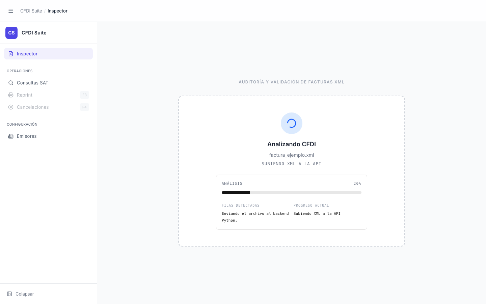

# Inspector — Cargando CFDI

> **Slug:** `inspector-loading`
> **Componente principal:** `src/components/FileUpload.tsx`
> **Trigger / Ruta:** `isLoading === true` en `FileUpload`, activado tras seleccionar un archivo `.xml` válido

---

## Propósito

Muestra el progreso de lectura y análisis del archivo CFDI. Hay dos sub-fases secuenciales: lectura del archivo con `FileReader` (fase rápida, en ms) y análisis con el backend Python via `POST /api/cfdi/analyze` (fase variable, típicamente 1–3 s). El usuario ve retroalimentación en tiempo real para ambas fases.

---

## Cómo se llega aquí

En `FileUpload.handleFile()` (`FileUpload.tsx:30`):
1. Se valida la extensión del archivo
2. `setIsLoading(true)`, `setPhase('reading')`, `setFileName(file.name)`
3. `FileReader.readAsText(file)` inicia
4. `reader.onprogress` actualiza el progreso de lectura
5. `reader.onload` → `setPhase('analyzing')` → llama a `onFileSelect(content)` (que invoca el backend)
6. Cuando el backend responde, `setIsLoading(false)`, `setPhase('idle')` → la app transiciona a `inspector-loaded`

---

## Componentes y Layout

- **Layout principal:** Idéntico a `inspector-empty`, pero la zona de drop muestra el contenido de carga
- **Fase `reading`:** ícono `FileText` azul, título "Leyendo archivo XML", barra con `progress%`
- **Fase `analyzing`:** spinner `LoaderCircle` animado, título "Analizando CFDI", `analysisLabel` de `useCfdiAnalysis`, barra con `analysisProgress` (20% al inicio, según el callback del backend)
- **Bloque monospaced:** muestra estado, porcentaje, y detalles adicionales (`analysisDetail`) cuando disponibles

---

## Funcionalidades

La pantalla es de solo lectura durante la carga. No hay acción disponible para el usuario (el click está bloqueado con `if (!isLoading)`).

---

## Flujo de Navegación

- **← `inspector-empty`:** al seleccionar archivo
- **→ `inspector-loaded`:** cuando `reader.onload` completa y el backend responde con éxito
- **→ `inspector-empty`:** si `reader.onerror` o el backend devuelve error (via `alert()`)

---

## Estados

| Estado | Trigger | Diferencia visual |
|--------|---------|-------------------|
| `phase=reading` | FileReader iniciado | Ícono FileText, título "Leyendo archivo XML", barra de progreso en % |
| `phase=analyzing` | `reader.onload` completo | Spinner animado, título "Analizando CFDI", `analysisLabel` del backend |
| `analyzing` con detalle | Backend envía callback con `detail` | Sección extra: "Filas detectadas" + "Progreso actual" |

---

## Edge Cases

- El progreso de la fase `reading` depende de que `e.lengthComputable` sea `true` en `reader.onprogress` — si es `false`, la barra no avanza.
- La fase `analyzing` muestra `analysisProgress ?? 100` — si el backend no llama a los callbacks de progreso, la barra aparece al 100% inmediatamente.
- El tiempo mínimo de análisis es de 450ms (`if (elapsed < 450) await new Promise(...)`), para evitar un flash de pantalla en CFDIs pequeños.
- La zona de drop ya no responde a clicks durante `isLoading`, pero el drag-and-drop no está bloqueado explícitamente.

---

## Preguntas para el Reviewer

1. ¿Tiene sentido mostrar la barra al 100% de `analysisProgress` mientras el backend aún está procesando? Si el backend no envía callbacks, el usuario ve el indicador "completo" pero nada ha terminado.
2. ¿El mínimo de 450ms es el tiempo correcto? Podría ser percibido como lentitud artificial en conexiones rápidas.
3. Si el usuario arrastra un archivo sobre la zona durante la carga (drag-and-drop no bloqueado), ¿qué ocurre?
