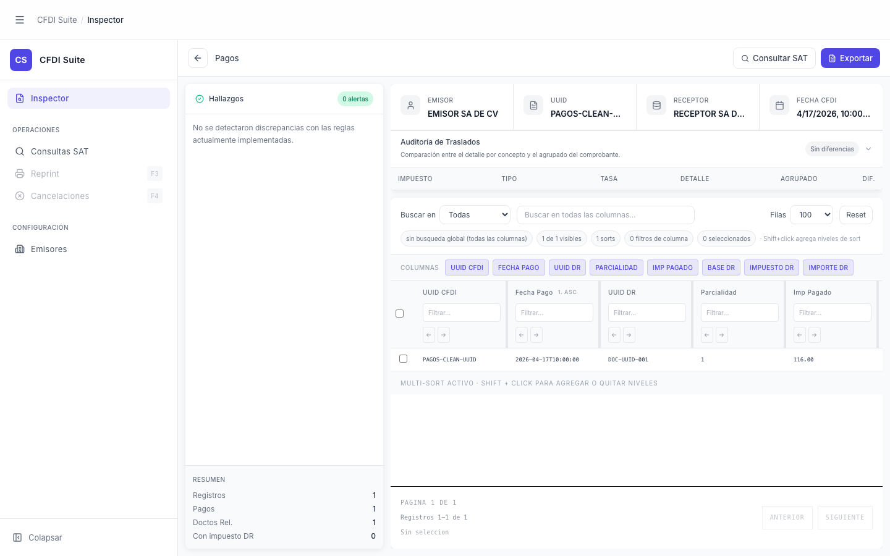

# Inspector — CFDI Pagos

> **Slug:** `inspector-pagos`
> **Componente principal:** `src/App.tsx`
> **Trigger / Ruta:** `activeView === 'inspector'` + `cfdi !== null` + `profile === 'pagos'`

---

## Propósito

Variante del inspector para CFDIs de tipo complemento de pagos (CFDI 4.0 con complemento de pago). Las columnas de la tabla y el dataset son distintos al de ingresos — enfocados en los pagos individuales con sus UUIDs relacionados, parcialidades, importes pagados y bases fiscales.

---

## Cómo se llega aquí

Igual que `inspector-ingreso`, pero el backend detecta que el XML tiene `profile === 'pagos'`:
1. `handleFileSelect` → `analyzeCFDI(xml)`
2. Backend retorna `result.profile === 'pagos'`
3. `setProfile('pagos')` → `activeDatasetType === 'pagos'` → columnas y dataset de pagos

---

## Componentes y Layout

Mismo layout que `inspector-ingreso`. La diferencia está en:
- `ExtractWorkspace` usa `PAGO_COLUMNS` (UUID CFDI, Fecha Pago, UUID DR, Parcialidad, Imp Pagado, Base DR, Impuesto DR, Importe DR) en lugar de `INGRESO_COLUMNS`
- `filteredPagoRows` como dataset activo en lugar de `filteredIngresoRows`
- `rfcEmisor` se extrae de `pagoRows[0]?.rfcEmisor` (diferente path que en ingresos)

---

## Funcionalidades

Idénticas a `inspector-ingreso`. Las diferencias funcionales son implícitas en los datos:
- Los registros representan documentos relacionados (pagos) no conceptos de venta
- Las columnas "Parcialidad" e "Imp Pagado" son únicas a este perfil

---

## Flujo de Navegación

Igual que `inspector-ingreso`.

---

## Estados

Igual que `inspector-ingreso`. El badge del perfil en `InspectorHeader` muestra "Pagos" en lugar de "Ingresos".

---

## Edge Cases

- Un XML de pagos puede tener múltiples nodos de pago — cada uno genera múltiples `pagoRows`. La tabla puede ser larga.
- `pagoRows[0]?.rfcEmisor` — si el XML tiene el RFC en una posición diferente del primer nodo, la consulta SAT puede usar un RFC incorrecto.
- El perfil `pagos` no tiene `TaxAuditPanel` de traslados por línea — ¿está el panel oculto o muestra datos vacíos? (Revisar en código si el panel se renderiza condicionalmente según perfil.)

---

## Preguntas para el Reviewer

1. ¿La distinción visual entre el inspector de Ingresos y el de Pagos es suficientemente clara? Actualmente solo cambia el badge de perfil y las columnas.
2. ¿El `TaxAuditPanel` aplica para CFDIs de pagos? La auditoría de traslados tiene sentido en ingresos pero puede ser confusa en pagos.
3. ¿Debería haber una vista resumen específica para pagos que muestre los totales por moneda o por documento relacionado?
4. ¿Qué pasa si un XML tiene tanto conceptos de ingresos como un complemento de pago? ¿Cuál perfil toma precedencia?
