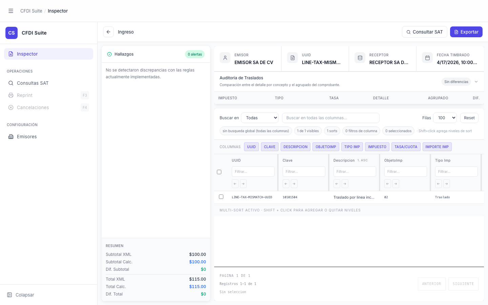

# Inspector — CFDI con Discrepancias

> **Slug:** `inspector-with-findings`
> **Componente principal:** `src/App.tsx`, `src/components/FindingsSidebar.tsx`
> **Trigger / Ruta:** `activeView === 'inspector'` + `cfdi !== null` + `cfdi.findings.length > 0`

---

## Propósito

Estado del inspector cuando el backend detecta discrepancias o inconsistencias en el CFDI. El panel de hallazgos muestra alertas clasificadas por severidad (critical / warning) con contexto detallado. Este es el estado de mayor valor para el auditor: indica exactamente qué revisar y por qué.

> **Nota:** En el momento de captura del screenshot, el backend (`satcfdi`) devuelve `findings: []` para los fixtures disponibles. Esta pantalla documenta el estado diseñado para cuando `cfdi.findings.length > 0`.

---

## Cómo se llega aquí

Igual que `inspector-ingreso`, pero el XML analizado contiene discrepancias que el motor del backend detecta y reporta en `result.cfdi.findings`.

---

## Componentes y Layout

Igual que `inspector-ingreso`. Las diferencias están en `FindingsSidebar`:
- Badge muestra `N alertas` en color naranja/rojo en lugar de verde
- Lista de findings con tarjetas expandibles por severidad
- Botón "Ver conceptos relacionados" visible en findings con `conceptLinks.length > 0`
- Si `cfdi.findings.length > 4`: botón "Ver todos" para expandir la lista completa

---

## Funcionalidades

Todas las funcionalidades de `inspector-ingreso`, más:

1. **Ver detalle de hallazgo:** clic en el hallazgo activa `setSelectedFindingId(finding.id)` → muestra guía de revisión y concepto sugerido
2. **Navegar al concepto relacionado:** botón "Abrir concepto sugerido" → abre `concept-detail-modal`
3. **Expandir lista completa:** botón "Ver todos" cuando hay más de 4 hallazgos → `setShowAllFindings(true)`

---

## Flujo de Navegación

- **← `inspector-empty`:** botón atrás
- **→ `concept-detail-modal`:** "Abrir concepto sugerido" cuando hay finding con conceptLinks
- **→ `findings-sidebar-expanded`:** clic en "Ver todos" cuando hay más de 4 hallazgos

---

## Estados

| Estado | Trigger | Diferencia visual |
|--------|---------|-------------------|
| Sin finding seleccionado | Default post-carga | Lista de findings, badge con count, sin guía de revisión |
| Finding seleccionado | `setSelectedFindingId(id)` | Botón del finding cambia a "Hallazgo enfocado" (azul), aparece guía de revisión |
| Lista colapsada | `cfdi.findings.length > 4` y `showAllFindings === false` | Solo primeros 4 findings visibles, badge "N hallazgos ocultos" |
| Lista expandida | Clic en "Ver todos" | Todos los findings visibles, badge "Lista completa visible" |

---

## Edge Cases

- Si un finding tiene `conceptLinks` pero el concepto ya no existe en `ingresoRows`, el botón "Abrir concepto sugerido" aparecería pero el modal mostraría datos inconsistentes
- La función `useFindingContexts` (`src/app/hooks/`) empareja findings con conceptos — si el matching falla silenciosamente, el finding queda sin context y no muestra el botón "Ver conceptos relacionados"
- Findings de tipo `critical` (rojo) vs `warning` (naranja) — actualmente los dos se muestran en la misma lista sin separación

---

## Preguntas para el Reviewer

1. ¿El badge de conteo de alertas en `FindingsSidebar` debería distinguir entre `critical` y `warning`? Actualmente muestra un número total.
2. Cuando hay muchos hallazgos (más de 10), ¿el flow de "Ver todos" funciona bien con el panel de altura fija que tiene scroll? ¿O el panel se desborda?
3. ¿La "Guía de revisión" es suficientemente útil para un auditor no técnico? ¿Qué nivel de detalle se espera ahí?
4. Si el usuario selecciona un finding y luego navega al concepto y regresa, ¿el finding sigue seleccionado o se resetea?
