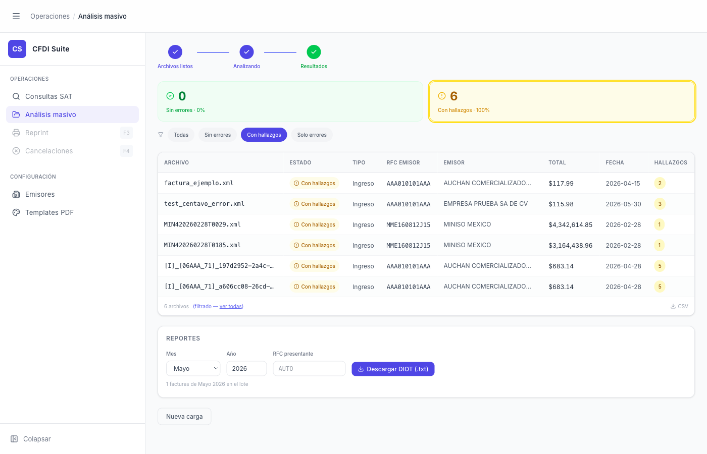

# Análisis Masivo — Resultados Filtrados

> **Slug:** `masivo-done-filtered`
> **Componente principal:** `src/components/BatchAnalysisPage.tsx` → `TriageHeader`
> **Trigger / Ruta:** `phase === 'done'` + `filterStatus !== 'all'`

---

## Propósito

Variante de la pantalla `masivo-done` con un filtro activo del TriageHeader. Permite al usuario enfocarse en un subconjunto de resultados: solo los que están bien, solo los que tienen discrepancias, o solo los que fallaron. La card del filtro activo se destaca con borde y fondo de color; el resto queda en segundo plano.

---

## Cómo se llega aquí

- Desde `masivo-done`: click en una card del TriageHeader ("Sin errores", "Con hallazgos", "Solo errores") o en los pills de filtro ("Sin errores", "Con hallazgos", "Solo errores")
- También desde `batch-completion-modal`: botón "Ver hallazgos →" activa el filtro "con_errores" y cierra el modal

---

## Componentes y Layout

Igual que `masivo-done`, con estas diferencias:

- **TriageHeader:** la card correspondiente al filtro activo tiene:
  - Borde color (verde/amarillo/rojo según tipo)
  - Fondo suave del mismo color
  - El filtro activo se refleja también en los pills de texto debajo ("Con hallazgos" pill en azul/morado cuando activo)

- **Tabla:** muestra solo las filas que coinciden con el filtro activo

- **Footer de tabla:** "N archivos (filtrado — ver todas)" con link "ver todas" que limpia el filtro

- **Icono de embudo** (🔽) en la esquina superior izquierda de la tabla cuando hay filtro activo

---

## Variantes de filtro

| Filtro | `filterStatus` | Filas mostradas | Card destacada |
|--------|---------------|----------------|----------------|
| Todas (default) | `'all'` | Todas | Ninguna |
| Sin errores | `'ok'` | Solo `status === 'ok'` | Card verde |
| Con hallazgos | `'con_errores'` | Solo `status === 'con_errores'` | Card amarilla + borde amarillo |
| Solo errores | `'error'` | Solo `status === 'error'` | Card roja |

---

## Funcionalidades

1. **Cambiar filtro:** click en otra card del TriageHeader o pill → cambia `filterStatus`
2. **Limpiar filtro:** click en "ver todas" en el footer de la tabla → `filterStatus = 'all'`
3. **Filtro "Todas":** click en pill "Todas" → limpia el filtro
4. **Drill-down desde fila filtrada:** el drill-down al Inspector funciona igual que en la vista sin filtrar

---

## Flujo de Navegación

- **↔ `masivo-done`:** click en "Todas" o "ver todas"
- **→ Inspector individual:** click en fila → ver `masivo-inspector-drilldown`
- **→ `masivo-done-only-errors`:** click en "Solo errores"

---

## Edge Cases

- Si el filtro activo produce 0 resultados (e.g., filtrar "Sin errores" en un lote donde todos tienen hallazgos), la tabla muestra 0 filas — no hay mensaje de "no hay resultados para este filtro"
- El DIOT en la sección REPORTES no cambia al filtrar — siempre opera sobre el lote completo
- El CSV exportado cuando hay filtro activo: no está documentado si exporta el lote filtrado o el total

---

## Preguntas para el Reviewer

1. ¿El CSV debería exportar solo las filas del filtro activo, o siempre todas? El comportamiento actual no es claro en la UI.
2. ¿Debería haber un mensaje de "0 resultados" cuando el filtro no devuelve nada, en lugar de mostrar una tabla vacía?
3. ¿Los pills de filtro son redundantes con las cards del TriageHeader? ¿Se podría simplificar a uno de los dos mecanismos?
