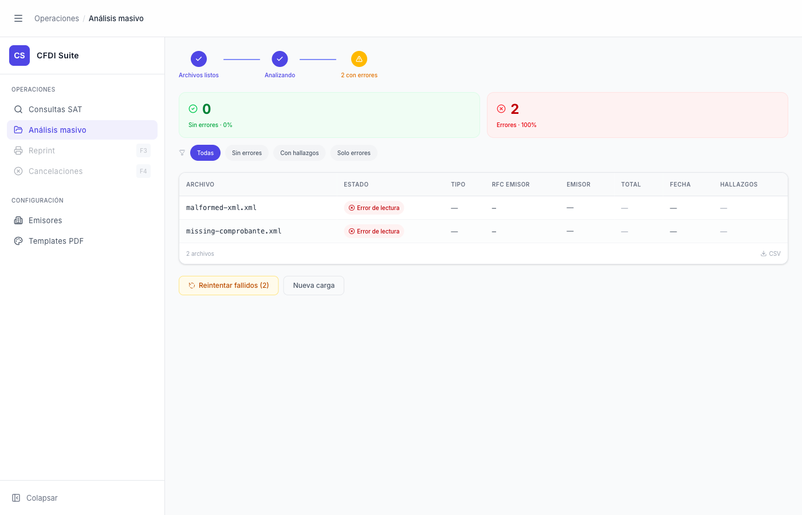

# Análisis Masivo — Solo Errores de Lectura

> **Slug:** `masivo-done-only-errors`
> **Componente principal:** `src/components/BatchAnalysisPage.tsx`
> **Trigger / Ruta:** `phase === 'done'` + todos los archivos con `status === 'error'`

---

## Propósito

Estado de la pantalla de resultados cuando el lote contiene únicamente errores de lectura — archivos XML que no pudieron ser procesados (malformados, no son CFDI, o el backend no pudo parsearlos). Comunica el fracaso del lote y ofrece la opción de reintentar.

---

## Cómo se llega aquí

- Automáticamente desde `masivo-processing` cuando todos los archivos terminan con `status === 'error'`
- También si el lote mixto tiene errores y el usuario activa el filtro "Solo errores" desde `masivo-done`

---

## Componentes y Layout

Diferencias respecto a `masivo-done`:

- **`BatchPipelineIndicator`:** paso 3 con ícono ⚠️ en naranja y texto "N con errores" (en lugar del ✓ verde)

- **`TriageHeader`:**
  - Card verde: "0 Sin errores · 0%" (fondo verde claro, pero número 0)
  - Card roja: "N Errores · 100%" (fondo rojo claro con borde rojo, destacada)
  - Card amarilla omitida si `conErrores === 0`

- **Tabla de resultados:**
  - Columnas: ARCHIVO, ESTADO, TIPO, RFC EMISOR, EMISOR, TOTAL, FECHA, HALLAZGOS
  - Estado de cada fila: badge rojo "⊗ Error de lectura"
  - Columnas TIPO, RFC EMISOR, EMISOR, TOTAL, FECHA, HALLAZGOS: todas muestran "—" (no hay datos)
  - Las filas con error NO son clicables (no tienen drill-down al inspector)

- **Sección REPORTES DIOT:** no aparece (no hay facturas válidas)

- **Botones:**
  - "Reintentar fallidos (N)" — botón naranja outline, prominente
  - "Nueva carga" — secundario outline

---

## Funcionalidades

1. **Reintentar fallidos:** mueve las filas con error de regreso al queue → reinicia `phase = 'processing'` solo con esos archivos → útil si el error fue transitorio (backend caído momentáneamente)
2. **Nueva carga:** regresa a `masivo-idle` limpiando todos los archivos

---

## Flujo de Navegación

- **→ `masivo-processing`:** clic en "Reintentar fallidos"
- **→ `masivo-idle`:** clic en "Nueva carga"

---

## Estados

| Estado | Diferencia visual |
|--------|-------------------|
| 100% errores (este) | Pipeline ámbar, card roja destacada, sin REPORTES |
| Errores parciales | Pipeline ámbar, card roja + otra card con datos, tabla mixta; "Reintentar fallidos" visible |

---

## Edge Cases

- Los errores de lectura suceden cuando el backend no puede parsear el XML: XML malformado, no es un CFDI 4.0 válido, falta el nodo `cfdi:Comprobante`, o el backend lanza una excepción no manejada
- "Reintentar fallidos" no cambia los archivos — si el XML siempre falla, el retry siempre dará error
- No hay distinción visual entre "archivo no es CFDI" vs "backend temporalmente caído" — ambos muestran "Error de lectura"

---

## Preguntas para el Reviewer

1. ¿Debería mostrarse el mensaje de error específico (e.g., "XML malformado" vs "Timeout del backend") para ayudar al usuario a diagnosticar?
2. ¿El botón "Reintentar fallidos" debería estar deshabilitado o mostrar un tooltip si el error es determinístico (XML inválido)?
3. ¿Cuántas veces se puede reintentar? ¿Hay un contador de intentos?
