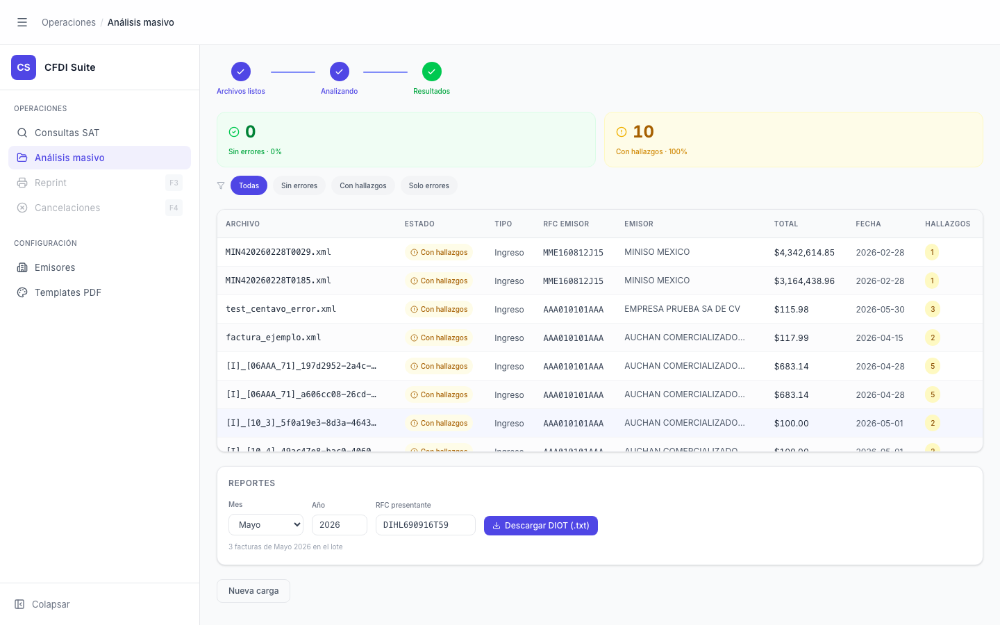

# Análisis Masivo — Resultados Completos

> **Slug:** `masivo-done`
> **Componente principal:** `src/components/BatchAnalysisPage.tsx`
> **Trigger / Ruta:** `activeView === 'masivo'` + `phase === 'done'`

---

## Propósito

Estado final del análisis batch. Muestra el resumen completo del lote con un triage de resultados por tipo, una tabla navegable de todos los archivos procesados, y la sección de Reportes DIOT para descargar el archivo de declaración. Cada fila es clicable para ir al Inspector individual del CFDI.

Al entrar por primera vez a este estado, aparece automáticamente el `BatchCompletionModal` — ver `batch-completion-modal`.

---

## Cómo se llega aquí

- Automáticamente desde `masivo-processing` cuando `completed === total`
- El `BatchCompletionModal` aparece al entrar si `showModal === true`

---

## Componentes y Layout

- **`BatchPipelineIndicator`** — 3 pasos todos en verde ✓ (o ámbar si hay errores)

- **`TriageHeader`** — grid de 2–3 columnas con cards clicables:
  - Card verde: "N Sin errores · X%"
  - Card amarilla: "N Con hallazgos · Y%"
  - Card roja: "N Errores · Z%" (solo si `errors > 0`)
  - Cada card es un botón de filtro; la activa tiene borde/fondo destacado
  - Filtros: "Todas" (pill azul), "Sin errores", "Con hallazgos", "Solo errores"

- **Tabla de resultados** — virtualizada con `@tanstack/react-virtual` (max-height 560px):
  - Columnas: ARCHIVO, ESTADO, TIPO, RFC EMISOR, EMISOR, TOTAL, FECHA, HALLAZGOS
  - Sorting por cualquier columna (icono de sort en header)
  - Fila clicable (cursor-pointer) si `status !== 'error'` → drill-down al Inspector
  - Footer: "N archivos · (filtrado — ver todas)" cuando hay filtro activo
  - Botón CSV export en la esquina inferior derecha

- **Sección REPORTES** — debajo de la tabla (requiere scroll):
  - Formulario: Mes (dropdown), Año (input), RFC presentante (input autocompletado)
  - Texto informativo: "N facturas de [Mes Año] en el lote"
  - Botón: "⬇ Descargar DIOT (.txt)"

- **Botones inferiores:**
  - "Reintentar fallidos (N)" — naranja outline, solo visible si `errors > 0`
  - "Nueva carga" — secundario outline, siempre visible

---

## Funcionalidades

1. **Filtrar resultados:** click en card del TriageHeader o pills → `setFilterStatus()` → tabla se filtra en frontend (sin petición al backend)
2. **Ver detalle de CFDI:** click en fila (si no es error) → `onSelectFile(file)` → drill-down al Inspector individual con `fromMasivo = true`
3. **Exportar CSV:** botón CSV genera un archivo descargable con todos los resultados del lote
4. **Descargar DIOT:** seleccionar mes/año/RFC → `batchDiot(files, params)` → descarga archivo `.txt` de formato DIOT
5. **Reintentar fallidos:** mueve los archivos con error de nuevo al queue y reinicia el procesamiento solo para ellos
6. **Nueva carga:** `resetForBatch()` → regresa a `masivo-idle`

---

## Flujo de Navegación

- **→ `masivo-done-filtered`:** click en card/pill del TriageHeader (misma vista, diferente filtro)
- **→ Inspector individual:** click en fila de resultado → ver `masivo-inspector-drilldown`
- **→ `masivo-idle`:** clic en "Nueva carga"
- **→ `masivo-processing`:** clic en "Reintentar fallidos" (parcial)

---

## Estados

| Estado | Trigger | Diferencia visual |
|--------|---------|-------------------|
| Todas (este) | Default al llegar a done | Filtro "Todas" activo, todas las filas visibles |
| Filtrado (Con hallazgos) | Click card amarilla | Ver `masivo-done-filtered` |
| Solo errores | Click card roja | Ver `masivo-done-only-errors` |
| Con modal abierto | Primer acceso a done | Ver `batch-completion-modal` |
| Pipeline ámbar | `errors > 0` | Paso 3 del pipeline en naranja en vez de verde |

---

## Edge Cases

- Si `stats.ok + stats.conErrores === 0` (todos son errores), la sección REPORTES no aparece porque no hay facturas válidas para generar DIOT
- El RFC presentante se auto-detecta con el RFC **receptor** (no emisor) del primer CFDI del lote cuyo RFC no sea el genérico XAXX010101000 ni XEXX010101000. Si todos los CFDIs tienen RFC receptor genérico, el campo permanece en el placeholder "AUTO" y el backend usa el valor vacío
- El filtro DIOT por mes/año filtra del lado del cliente sobre los resultados ya procesados
- La columna HALLAZGOS solo muestra badge cuando `findings_count > 0`; cuando es 0, la celda queda vacía (no muestra "0")
- El sort de la tabla es client-side sobre todos los resultados del lote; con lotes de 1000+ archivos el sort puede ser lento

---

## Preguntas para el Reviewer

1. ¿Debería la sección REPORTES estar más arriba (o en un tab separado) para usuarios cuyo flujo principal es generar el DIOT?
2. ¿La columna HALLAZGOS sin valor para filas sin hallazgos debería mostrar "—" o "0" para ser más clara?
3. ¿El CSV exportado incluye solo los archivos filtrados o siempre todos? Debería ser documentado en la UI.
4. ¿Qué pasa si el usuario reintenta los fallidos y uno de ellos falla de nuevo? ¿Se queda en estado error o hay un límite de reintentos?
