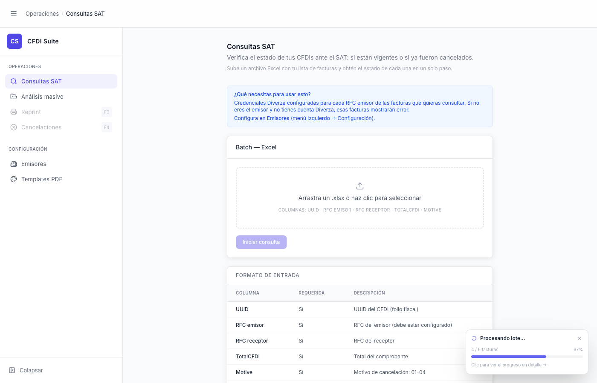

# Análisis Masivo — Widget Flotante (FloatingBatchWidget)

> **Slug:** `masivo-floating-widget`
> **Componente principal:** `src/components/FloatingBatchWidget.tsx`
> **Trigger / Ruta:** `batchProgressStatus !== null` + `activeView !== 'masivo'`

---

## Propósito

Widget de progreso flotante que aparece en la esquina inferior derecha cuando el usuario navega a otra sección mientras el análisis masivo está en curso. Mantiene la visibilidad del progreso del lote sin interrumpir el trabajo en la vista actual. Permite al usuario volver al Masivo con un clic.

---

## Cómo se llega aquí

- El usuario está en `masivo-processing` (el batch está corriendo)
- El usuario hace clic en cualquier otro ítem del sidebar (e.g., "Consultas SAT", "Reprint", etc.)
- `App.tsx` detecta que `batchProgressStatus !== null` y la vista cambió → renderiza `<FloatingBatchWidget>`

---

## Componentes y Layout

- **Posición:** fija, esquina inferior derecha (`fixed bottom-4 right-4`)
- **Card compacta (ancho ~280px, altura ~72px):**
  - Ícono de carga (spinner) a la izquierda
  - Texto: "Procesando lote..." (bold) en la primera línea
  - Texto: "N / Total facturas" + porcentaje en texto gris
  - Barra de progreso azul debajo
  - Texto link: "Clic para ver el progreso en detalle →" en azul/morado
  - Botón ✕ (cierre) en la esquina superior derecha de la card

- **Estado `done`:** cuando el batch termina mientras el usuario está en otra vista:
  - Cambia a ícono ✓ verde
  - Texto: "Lote completado — N facturas"

---

## Funcionalidades

1. **Navegar de regreso:** clic en cualquier parte del widget (excepto ✕) → `onNavigate()` → `setActiveView('masivo')`
2. **Cerrar widget:** clic en ✕ → `onDismiss()` → oculta el widget (el batch sigue corriendo en background); el widget no vuelve a aparecer para ese lote
3. **Progreso en tiempo real:** el widget actualiza su progreso mientras el batch corre, sin importar la vista activa

---

## Flujo de Navegación

- **→ `masivo-processing`:** clic en el widget → regresa al Masivo en curso
- **→ (dismissal):** clic en ✕ → widget desaparece, batch continúa silenciosamente

---

## Estados

| Estado | `status.phase` | Diferencia visual |
|--------|---------------|-------------------|
| Procesando (este) | `'processing'` | Spinner azul, texto "Procesando lote...", barra de progreso |
| Completado | `'done'` | ✓ verde, texto "Lote completado — N facturas", sin barra de progreso |

---

## Edge Cases

- Si el usuario hace clic en ✕ para descartar el widget y el batch termina después, no hay ningún otro aviso de que terminó (sin notificación push, sin badge en el sidebar)
- El widget no aparece si el usuario está en la vista Masivo (`activeView === 'masivo'`) — incluso si el componente está scrolleado hacia arriba
- `onDismiss` solo oculta el widget pero el batch continúa; si el usuario luego hace clic en "Análisis masivo" en el sidebar, el componente está montado y el estado de progreso sigue activo
- El widget puede solaparse con contenido importante en vistas que tienen contenido en la esquina inferior derecha (e.g., tooltips, botones de acción)

---

## Preguntas para el Reviewer

1. ¿Qué pasa si el usuario descarta el widget (✕) y el batch termina? ¿Hay algún aviso de completado? Actualmente parece que no.
2. ¿Debería el widget aparecer también en estado `done` aunque el usuario lo haya descartado antes? (Para notificarle que terminó)
3. ¿Hay riesgo de que el widget se superponga con el botón "Colapsar" del sidebar en la esquina inferior izquierda? No, pero hay que considerar el scroll horizontal en viewports pequeños.
4. ¿El porcentaje de progreso en el widget coincide exactamente con el de la pantalla principal, o puede haber un desfase por el batching de updates de React?
