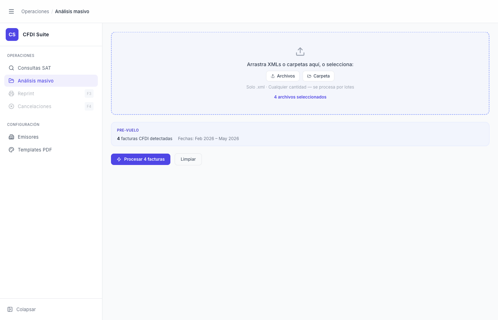

# Análisis Masivo — Archivos Seleccionados (Pre-vuelo)

> **Slug:** `masivo-idle-with-preflight`
> **Componente principal:** `src/components/BatchAnalysisPage.tsx` → `PreflightCard`
> **Trigger / Ruta:** `activeView === 'masivo'` + `phase === 'idle'` + `files.length > 0` + `preflight !== null`

---

## Propósito

Estado intermedio del idle: el usuario ha seleccionado archivos pero aún no ha iniciado el procesamiento. La `PreflightCard` muestra un resumen rápido del lote (cantidad de CFDIs detectados, rango de fechas) calculado client-side sin llamadas al backend. Confirma que los archivos son CFDI válidos antes de procesar.

---

## Cómo se llega aquí

- Desde `masivo-idle`: el usuario selecciona o arrastra archivos `.xml`
- El análisis preflight se ejecuta automáticamente vía `useEffect` sobre `files` → `runPreflight(files)` (función en `src/lib/preflight.ts`)
- El preflight es 100% client-side: lee el texto de los archivos en el browser, no llama al backend

---

## Componentes y Layout

- **DropZone:** El borde cambia de gris a azul punteado; aparece el texto "N archivos seleccionados" en azul
- **PreflightCard** (`src/components/BatchAnalysisPage.tsx` línea ~180): tarjeta con fondo muy suave
  - Etiqueta "PRE-VUELO" en texto muy pequeño color morado
  - "N facturas CFDI detectadas" (bold)
  - "Fechas: [min] – [max]" cuando hay fechas detectadas
  - "N posibles duplicados" cuando `possibleDuplicates > 0`
  - "Emisores: RFC1, RFC2, ..." cuando hay emisores detectados (top 3)
- **Botones de acción:**
  - "Procesar N facturas" — primario, morado filled
  - "Limpiar" — secundario, outline gris
- **State:** `phase === 'idle'`, `files = [File, ...]`, `preflight = PreflightSummary`, `preflightLoading = false`

---

## Funcionalidades

1. **Iniciar procesamiento:** clic en "Procesar N facturas" → `handleProcess()` → cambia `phase` a `'processing'`
2. **Limpiar selección:** clic en "Limpiar" → `setFiles([])`, `setPreflight(null)` → regresa a `masivo-idle`
3. **Agregar más archivos:** el usuario puede volver a usar el drop zone o los botones para agregar más archivos; `dedupeFiles` evita duplicados por nombre
4. **Ver emisores top:** la PreflightCard muestra hasta 3 RFCs emisores más frecuentes en el lote

---

## Flujo de Navegación

- **← `masivo-idle`:** clic en "Limpiar" o eliminar todos los archivos
- **→ `masivo-processing`:** clic en "Procesar N facturas"

---

## Estados

| Estado | Trigger | Diferencia visual |
|--------|---------|-------------------|
| PreflightCard cargando | Inmediatamente después de seleccionar archivos | `preflightLoading === true`, skeleton o spinner (no claramente visible en el código actual) |
| PreflightCard con datos (este) | `runPreflight` completado | Datos de fechas, cantidad, emisores |
| PreflightCard con duplicados | `preflight.possibleDuplicates > 0` | Badge "N posibles duplicados" en naranja |

---

## Edge Cases

- Si el lote contiene archivos que no son CFDI (e.g., `malformed-xml.xml`), `validCfdi` puede ser 0 mientras `totalFiles > 0` — el botón sigue habilitado, y el procesamiento puede terminar solo con errores
- El preflight escanea máximo 50 archivos (`SAMPLE_SIZE = Math.min(50, files.length)`) — para lotes grandes, los conteos son estimados con un ratio de extrapolación
- La deduplicación es por nombre de archivo, no por UUID del CFDI — un mismo CFDI renombrado puede entrar dos veces
- Si el usuario agrega archivos después de que el preflight terminó, `useEffect` re-ejecuta el análisis completo sobre todos los archivos actuales

---

## Preguntas para el Reviewer

1. ¿Debería haber un estado visual de loading entre seleccionar archivos y ver la PreflightCard? Actualmente la transición es instantánea (el efecto es async pero rápido).
2. ¿Debería el botón "Procesar" estar deshabilitado si `validCfdi === 0` y todos los archivos son inválidos? Actualmente siempre está habilitado.
3. ¿Qué pasa con el conteo si el usuario tiene un lote de 500 XMLs pero solo se escanean 50? ¿El usuario entiende que es una estimación?
4. ¿Debería la PreflightCard mostrar el tamaño total del lote en bytes o MB para dar feedback sobre el tiempo esperado?
