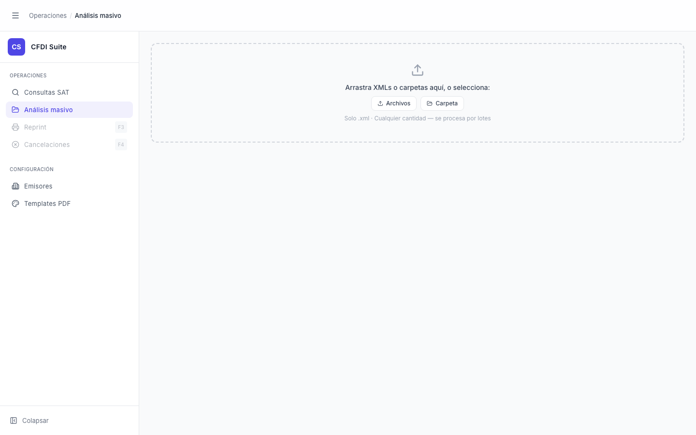

# Análisis Masivo — Vacío (Drop Zone)

> **Slug:** `masivo-idle`
> **Componente principal:** `src/components/BatchAnalysisPage.tsx`
> **Trigger / Ruta:** `activeView === 'masivo'` + `phase === 'idle'` + `files.length === 0`

---

## Propósito

Pantalla de entrada al módulo de Análisis Masivo. Permite al usuario seleccionar uno o varios archivos CFDI XML (o carpetas completas) para procesarlos en lote. Es la pantalla principal de la herramienta: el punto de inicio del flujo de análisis batch.

---

## Cómo se llega aquí

- Clic en "Análisis masivo" en la barra lateral (AppNav)
- Estado por defecto al arrancar la aplicación (`activeView` inicial es `'masivo'`)
- Después de hacer clic en "Limpiar" en el estado idle con archivos
- Después de hacer clic en "Nueva carga" en la fase `done`

---

## Componentes y Layout

- **Layout principal:** Columna única, padding `p-6`, área de contenido a la derecha del sidebar
- **Componentes hijos visibles:**
  - `AppNav` — "Análisis masivo" activo
  - `AppHeader` — breadcrumb "Operaciones / Análisis masivo"
  - `DropZone` — zona de drop con borde gris punteado, ícono upload, texto instructivo
  - Dos botones: "Archivos" y "Carpeta" (dentro del DropZone)
- **State:** `phase === 'idle'`, `files = []`, `preflight = null`
- **Estado del sidebar:** Expandido

---

## Funcionalidades

1. **Drag & drop:** Arrastrar archivos `.xml` o carpetas sobre la zona → `handleFileDrop` → `setFiles(dedupeFiles([...]))`
2. **Seleccionar archivos:** Botón "Archivos" → `fileInputRef.current.click()` → `<input type="file" multiple accept=".xml">`
3. **Seleccionar carpeta:** Botón "Carpeta" → `folderInputRef.current.click()` → `<input type="file" multiple webkitdirectory accept=".xml">`

---

## Flujo de Navegación

- **→ `masivo-idle-with-preflight`:** cuando el usuario selecciona o arrastra al menos un XML válido
- **→ otras vistas:** mediante navegación por el sidebar (el estado no persiste al regresar — el componente se desmonta)

---

## Estados

| Estado | Trigger | Diferencia visual |
|--------|---------|-------------------|
| Drop zone sin archivos (este) | Default, o después de "Limpiar" | Borde gris punteado, sin conteo de archivos |
| Drop zone con archivos | Archivo(s) seleccionado(s) | Ver `masivo-idle-with-preflight` |
| Drop zone en hover (drag activo) | Usuario arrastra archivos encima | Borde azul, fondo ligeramente azulado (no capturado) |

---

## Edge Cases

- Solo acepta `.xml` — otros formatos se ignoran silenciosamente vía `accept=".xml"` en el input; no hay feedback al usuario si arrastra un .pdf o .zip
- Al seleccionar carpeta (`webkitdirectory`), el atributo se asigna vía `useEffect` porque TypeScript no permite este prop en JSX
- Si el usuario navega a otra vista y regresa, el estado de `BatchAnalysisPage` se reinicia por el unmount/remount de React (no hay persistencia local)
- No hay límite de cantidad de archivos mostrado al usuario — solo el subtítulo "Cualquier cantidad — se procesa por lotes"

---

## Preguntas para el Reviewer

1. ¿Debería mostrar un mensaje de error si el usuario arrastra un archivo que no es `.xml`? Actualmente la operación se ignora sin feedback.
2. ¿Hay un límite práctico de archivos que se puede subir? ¿Debería mostrarse al usuario?
3. ¿Qué pasa si el usuario arrastra archivos desde un sistema de archivos remoto (OneDrive montado, etc.)? ¿Se comporta igual?
4. ¿El estado del batch debería persistir si el usuario navega a otra vista y regresa? Actualmente se pierde.
