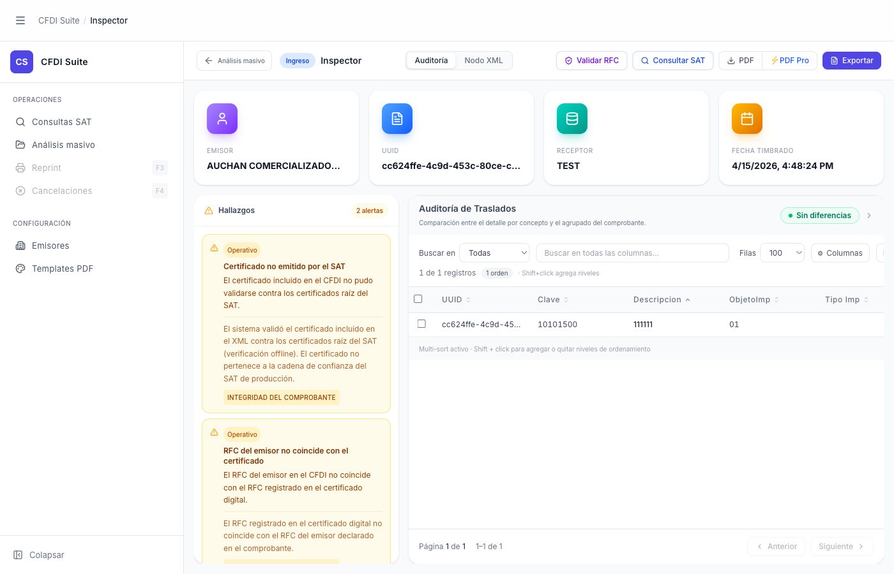

# Análisis Masivo — Inspector Individual (Drill-down)

> **Slug:** `masivo-inspector-drilldown`
> **Componente principal:** `src/App.tsx` (orquestador), `src/components/InspectorHeader.tsx`
> **Trigger / Ruta:** `activeView === 'inspector'` + `fromMasivo === true`

---

## Propósito

Vista del Inspector individual cargada desde una fila de la tabla de resultados del Masivo. Permite revisar en detalle un CFDI específico — sus hallazgos, traslados, datos del emisor — sin perder el contexto del lote. La diferencia respecto al Inspector estándar es el breadcrumb de regreso y el estado `fromMasivo` que controla el comportamiento del botón de navegación.

---

## Cómo se llega aquí

- Desde `masivo-done` o `masivo-done-filtered`: click en una fila con `status !== 'error'`
- `BatchAnalysisPage.onSelectFile(file)` → `App.tsx` → `resetForBatch()` + `handleFileSelect(file)` + `setActiveView('inspector')` + `fromMasivo = true`
- Hay un estado transitorio de `CfdiAnalysisLoader` (spinner de carga) mientras el backend analiza el archivo seleccionado

---

## Componentes y Layout

- **Breadcrumb / Navegación superior:**
  - Botón izquierda: "← Análisis masivo" (regresa al Masivo)
  - Breadcrumb: "← Análisis masivo / [TIPO] / Inspector"
  - Tabs: Auditoria, Nodo XML (y otros si aplica)
  - Acciones: Validar RFC, Consultar SAT, PDF, PDF Pro, Exportar

- **Cards de cabecera:**
  - EMISOR (nombre truncado)
  - UUID (hash truncado, monospace)
  - RECEPTOR
  - FECHA TIMBRADO

- **Panel de Hallazgos** (sidebar izquierdo):
  - Etiqueta "Hallazgos N alertas" en naranja
  - Lista de hallazgos expandibles con severidad (Operativo, Crítico)
  - Cada hallazgo: código, descripción larga, categoría (ej. "INTEGRIDAD DEL COMPROBANTE")

- **Panel principal** (derecha):
  - Tabla de Auditoría de Traslados (u otro tab activo)
  - Buscador, filtros de filas, selector de columnas

---

## Funcionalidades

1. **Regresar al Masivo:** clic en "← Análisis masivo" en el breadcrumb → `resetForBatch()` + `setActiveView('masivo')` — el estado del Masivo (fase done, tabla de resultados) se preserva
2. **Navegar entre CFDIs:** no hay navegación directa entre CFDIs del lote desde el Inspector — se debe regresar al Masivo y hacer clic en otra fila
3. **Todas las funcionalidades del Inspector:** el Inspector en drill-down tiene las mismas funcionalidades que el Inspector estándar (ver Inspector docs)

---

## Flujo de Navegación

- **← `masivo-done`:** clic en "← Análisis masivo" en el breadcrumb
- El estado de la fase done persiste: la tabla de resultados, el filtro activo y los datos del lote se mantienen

---

## Estados

| Estado | Trigger | Diferencia visual |
|--------|---------|-------------------|
| Cargando (CfdiAnalysisLoader) | Entre click en fila y carga completa | Ver `inspector-loading` — spinner centralizado |
| Inspector cargado con hallazgos (este) | CFDI analizado, findings > 0 | Panel de hallazgos con alertas activo |
| Inspector cargado sin hallazgos | CFDI limpio | Panel de hallazgos con badge verde "Sin alertas" |

---

## Edge Cases

- El botón "← Análisis masivo" solo aparece si `fromMasivo === true`; si el usuario llegó al Inspector de forma estándar (no desde el Masivo), el botón no existe y el flujo de regreso es diferente
- Si el usuario hace clic en otro ítem del sidebar mientras está en el Inspector post-drilldown, se pierde el `fromMasivo` context — el botón de regreso desaparece
- No hay indicación visual de "cuántos CFDIs quedan en el lote" ni de la posición del CFDI actual dentro del lote
- El `pendingFileName` en `App.tsx` es solo para tracking interno; el usuario ve el nombre en el breadcrumb pero no tiene una forma de navegar a siguiente/anterior

---

## Preguntas para el Reviewer

1. ¿Debería haber navegación anterior/siguiente entre los CFDIs del lote desde el Inspector, sin tener que regresar al Masivo cada vez?
2. ¿El estado del filtro activo en el Masivo se preserva al regresar con "← Análisis masivo"? (Si el usuario tenía "Con hallazgos" activo, ¿sigue activo al regresar?)
3. ¿Debería el breadcrumb incluir el nombre del archivo (ej. "← Masivo / factura_ejemplo.xml / Inspector") para orientar mejor al usuario?
4. Si el usuario abre el Inspector desde el Masivo y luego hace PDF Pro, ¿el PDF incluye información del contexto del lote o es un PDF estándar?
