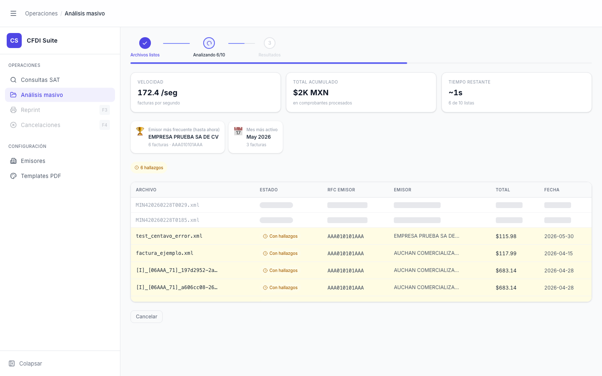
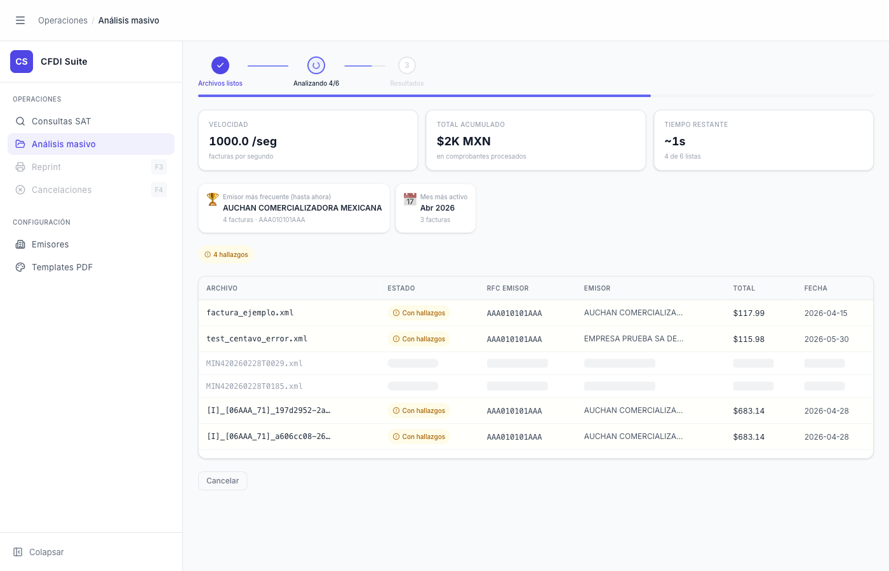

# Análisis Masivo — Procesando

> **Slug:** `masivo-processing`
> **Componente principal:** `src/components/BatchAnalysisPage.tsx`
> **Trigger / Ruta:** `activeView === 'masivo'` + `phase === 'processing'`

---

## Propósito

Estado activo del procesamiento batch. La pantalla se transforma completamente: aparecen métricas en tiempo real (velocidad, total acumulado, tiempo restante), insights del lote que se van construyendo, y una tabla en vivo donde cada fila aparece con una animación flash al completarse. El usuario puede ver el progreso fila por fila y tiene la opción de cancelar.

---

## Cómo se llega aquí

- Desde `masivo-idle-with-preflight`: clic en "Procesar N facturas"
- `handleProcess()` → `batchAnalyzePool(files, callback, poolSize=8)` en `src/lib/batch-api-client.ts`

---

## Componentes y Layout

- **`BatchPipelineIndicator`** (`src/components/BatchPipelineIndicator.tsx`):
  - 3 pasos: "Archivos listos" (✓ azul) → "Analizando N/Total" (spinner animado, paso activo) → "Resultados" (gris, inactivo)
  - Barra de progreso debajo del pipeline (azul)

- **StatsCards** — 3 tarjetas en grid de 3 columnas:
  - "VELOCIDAD — N.N /seg — facturas por segundo"
  - "TOTAL ACUMULADO — $XK MXN — en comprobantes procesados"
  - "TIEMPO RESTANTE — ~Xs — N de Total listas"

- **InsightCards** — tarjetas de insights que aparecen solo cuando hay datos suficientes:
  - 🏆 "Emisor más frecuente (hasta ahora): [NOMBRE] — N facturas · [RFC]"
  - 📅 "Mes más activo: [Mes Año] — N facturas"

- **Badge de conteo:** "⚠️ N hallazgos" en naranja, visible cuando `stats.conErrores > 0`

- **`LiveQueueTable`** — tabla virtualizada (`@tanstack/react-virtual`):
  - Columnas: ARCHIVO, ESTADO, RFC EMISOR, EMISOR, TOTAL, FECHA
  - Filas pendientes: nombre de archivo en gris/tenue, columnas con skeleton loader animado
  - Filas completadas: datos reales + badge de estado
  - Animación `row-flash-ok/yellow/red` durante 1200ms al completarse una fila

- **Botón "Cancelar"** — secundario, outline, abajo de la tabla

---

## Funcionalidades

1. **Progreso en tiempo real:** `batchAnalyzePool` llama al callback por cada resultado → actualiza `queue`, `stats` calculados por `useBatchStats`
2. **Cancelar batch:** clic en "Cancelar" → `abortRef.current.abort()` → detiene todas las peticiones en vuelo → vuelve a `phase === 'idle'` con los archivos pendientes
3. **Ver fila completada:** cada fila flash al completarse; el usuario puede hacer scroll para ver resultados parciales
4. **Navegación durante procesamiento:** si el usuario navega a otra vista, aparece el `FloatingBatchWidget` — ver `masivo-floating-widget`

---

## Flujo de Navegación

- **→ `masivo-done`:** cuando `completed === total` (todos procesados) → `phase` cambia automáticamente a `'done'`
- **→ `masivo-idle`:** clic en "Cancelar" (los archivos siguen en memoria, se muestra el idle con la lista)
- **→ `masivo-floating-widget`:** navegar a cualquier otra vista durante el procesamiento

---

## Estados

| Estado | Trigger | Diferencia visual |
|--------|---------|-------------------|
| Inicio (este) | ~0-400ms después de "Procesar" | Pocas filas completadas, tabla mayormente en skeleton |
| Avance medio | `completed ≈ total/2` | Tabla semi-llena, insights aparecen, métricas estables |
| Casi terminado | `completed = total - 1` | Tabla casi completa, "Tiempo restante ~0s" |

---

## Edge Cases

- Si el backend está caído, todas las filas terminarán en estado `error` — la tabla se llena de rojo pero `phase` sí llega a `'done'`
- Si el pool tiene tamaño 8 y hay 3 archivos, solo se abren 3 conexiones simultáneas
- La velocidad "N /seg" puede ser muy alta para lotes pequeños (distorsiona la métrica de tiempo restante)
- El InsightCard de emisor solo aparece cuando `stats.topEmisores.length > 0`, que requiere al menos 1 archivo con RFC emisor reconocido
- Las filas se ordenan por orden de aparición (las que terminan primero suben), no por nombre de archivo — puede ser confuso para el usuario

---

## Preguntas para el Reviewer

1. ¿La tabla debería mantener el orden original de los archivos (por posición en el lote) o seguir ordenándose por orden de completado como actualmente?
2. ¿Qué pasa si el usuario cancela cuando ya hay 90% de archivos completados? ¿Se pierden los resultados parciales o quedan en memoria?
3. ¿Debería el badge "N hallazgos" mostrar breakdown de tipos (crítico/advertencia) en tiempo real?
4. ¿Hay algún límite de memoria al procesar lotes de 1000+ archivos? El virtualizer maneja el DOM, pero los `File` objects en memoria sí ocupan espacio.
