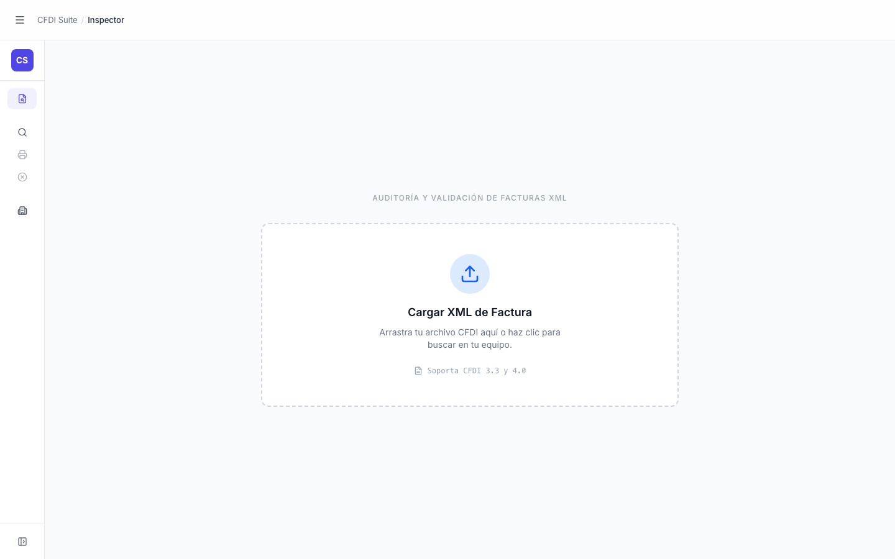

# Sidebar — Colapsado

> **Slug:** `sidebar-collapsed`
> **Componente principal:** `src/components/AppNav.tsx`
> **Trigger / Ruta:** `sidebarCollapsed === true` en `App.tsx:54` — activado por clic en "Colapsar" o en el icono `PanelLeftOpen`

---

## Propósito

Modo compacto del sidebar de navegación. Oculta las etiquetas de texto y colapsa el sidebar a 72px de ancho (solo iconos), liberando espacio horizontal para el contenido principal. Útil en pantallas pequeñas o cuando el usuario prefiere maximizar el área de trabajo.

---

## Cómo se llega aquí

- Desde cualquier vista con sidebar expandido: clic en el botón "Colapsar" (icono `PanelLeftClose`) en la parte inferior del sidebar → `setSidebarCollapsed(true)`

---

## Componentes y Layout

- **Sidebar:** ancho `w-[72px]` (vs `w-72` expandido) con transición CSS `transition-[width] duration-200 ease-in-out`
- **Íconos:** solo se muestran los íconos de cada ítem de navegación (sin etiquetas de texto)
- **Brand:** solo el cuadrado "CS" (oculta "CFDI Suite")
- **Secciones:** las etiquetas de sección ("Operaciones", "Configuración") desaparecen
- **Toggle:** ícono cambia a `PanelLeftOpen` con `title="Expandir sidebar"` para re-expandir
- **Tooltips:** los botones del nav tienen `title={collapsed ? item.label : undefined}` — al hacer hover se muestra el nombre de la vista

---

## Funcionalidades

1. **Expandir:** clic en el botón con ícono `PanelLeftOpen` → `setSidebarCollapsed(false)` → sidebar regresa a `w-72`
2. **Navegar:** los ítems del nav siguen siendo clickeables; los badges de fase (F3, F4) no se muestran en modo colapsado
3. **AppHeader:** tiene su propio botón de toggle del sidebar → misma funcionalidad (`onToggleSidebar`)

---

## Flujo de Navegación

- **← Origen:** cualquier vista con sidebar expandido
- **→ Sidebar expandido:** clic en icono `PanelLeftOpen`

---

## Estados

| Estado | Trigger | Diferencia visual |
|--------|---------|-------------------|
| Colapsado | `collapsed === true` | w-[72px], solo íconos, brand reducido |
| Expandido | `collapsed === false` | w-72, etiquetas de texto, secciones visibles |

---

## Edge Cases

- El estado `sidebarCollapsed` vive en `App.tsx` — se preserva al navegar entre vistas, pero no persiste entre recargas de la app.
- Los ítems deshabilitados (Reprint F3, Cancelaciones F4) no tienen `title` en modo colapsado (solo los habilitados lo tienen) — en modo colapsado no hay forma de saber cuál es cuál sin hacer hover en el botón.
- El `AppHeader` también tiene un botón para colapsar/expandir el sidebar (`onToggleSidebar`). Ambos sincronizan el mismo estado.

---

## Preguntas para el Reviewer

1. ¿Debería el estado `sidebarCollapsed` persistirse en `localStorage` para que se recuerde entre sesiones?
2. Los ítems deshabilitados no muestran `title` en modo colapsado — ¿debería mostrarse igualmente para que el usuario sepa qué íconos representan?
3. ¿La transición de 200ms es perceptible? ¿Debería ser más rápida o lenta según el design system?
