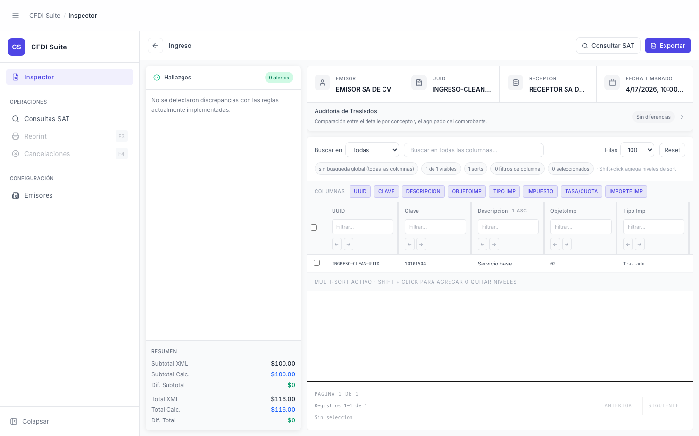

# Panel Auditoría de Traslados — Colapsado

> **Slug:** `tax-audit-collapsed`
> **Componente principal:** `src/components/TaxAuditPanel.tsx`
> **Trigger / Ruta:** Inspector cargado + `taxAuditExpanded === false` (toggle desde `App.tsx:68`)

---

## Propósito

Estado del `TaxAuditPanel` cuando el usuario lo cierra para ganar espacio vertical en la tabla de conceptos. La fila del panel sigue visible (con el badge de diferencias y el chevron orientado hacia la derecha), pero la tabla comparativa está oculta.

---

## Cómo se llega aquí

1. Cargar un CFDI (inspector-ingreso o inspector-with-findings)
2. Hacer clic en la fila del panel "Auditoría de Traslados"
3. `onToggle` → `setTaxAuditExpanded(false)` en `App.tsx`

El panel inicia **expandido** por defecto (`useState(true)` en `App.tsx:68`). Al cargar un nuevo CFDI (`resetForFileSelect`), también se resetea a expandido.

---

## Componentes y Layout

- **TaxAuditPanel:** barra de título con badge de diferencias + chevron derecho (`rotate-90` ausente = colapsado)
- **Sin tabla:** `{taxAuditExpanded && <table...>}` — la tabla no se renderiza en el DOM cuando está colapsado
- **ExtractWorkspace:** ocupa más altura vertical al eliminar la tabla del panel

---

## Funcionalidades

1. **Expandir:** clic en la fila del panel → `setTaxAuditExpanded(true)` → tabla visible

---

## Flujo de Navegación

- **→ `inspector-ingreso` (expandido):** clic en la fila del panel

---

## Estados

| Estado | Trigger | Diferencia visual |
|--------|---------|-------------------|
| Colapsado | `taxAuditExpanded === false` | Chevron horizontal, sin tabla, la tabla no existe en DOM |
| Expandido | `taxAuditExpanded === true` | Chevron rotado 90°, tabla visible con scroll máximo `max-h-36` |
| Sin diferencias | `diffCount === 0` | Badge gris "Sin diferencias" |
| Con diferencias | `diffCount > 0` | Badge rojo "N diferencias" |

---

## Edge Cases

- `diffCount` se calcula en `TaxAuditPanel` comparando los traslados por concepto vs el agrupado del comprobante — si el CFDI no tiene impuestos declarados, `diffCount === 0` y el badge muestra "Sin diferencias" (correcto)
- La tabla tiene `max-h-36 overflow-auto` — con más de ~5 filas de traslados, el contenido es scrollable dentro del panel. El scroll del panel es independiente del scroll principal
- Al resetear el análisis, `taxAuditExpanded` vuelve a `true` (`resetForFileSelect` lo resetea explícitamente) — esto es comportamiento intencional

---

## Preguntas para el Reviewer

1. ¿El panel debería recordar si el usuario lo colapsó entre cargas de distintos CFDIs? Actualmente siempre inicia expandido.
2. Con `max-h-36` el panel tiene ~144px de altura para la tabla — ¿es suficiente para CFDIs con muchos tipos de traslados (ej. 10+ filas)?
3. ¿El badge de "N diferencias" debería ser clickeable para ir directamente al hallazgo correspondiente en FindingsSidebar?
